<div align="center">

# MD Reader


### A Local-First, Native Markdown Projection Engine with Stateful Hypertext Traversal

**One binary. One document graph. Zero browser-tab entropy.**

[](https://www.rust-lang.org/)
[](https://github.com/emilk/egui)
[](https://github.com/grovesNL/glow)
[](#supported-document-semantics)
[](#macro-architecture)
[](#verification-matrix)
[](#macro-architecture)
[](#visual-system)

*A compact desktop Markdown reader documented with the seriousness of a systems paper and the diagram density of an aerospace review.*

</div>

> [!NOTE]
> The terminology in this README is intentionally dramatic. The implementation is deliberately small, direct, and practical. Every functional claim below is grounded in the Rust source; no imaginary throughput numbers or nanosecond benchmarks have been invented.

**Implementation map:** [`src/main.rs`](src/main.rs) is an eight-line native launcher. [`src/app.rs`](src/app.rs) owns application state and transitions. [`src/ui/components.rs`](src/ui/components.rs) and [`src/ui/theme.rs`](src/ui/theme.rs) compose the responsive interface and liquid-glass visual system. The library facade in [`src/lib.rs`](src/lib.rs) re-exports focused document, indexing, link, navigation, and lexical-analysis modules.

---

## Abstract

**MD Reader** is a native desktop application for deterministic projection of UTF-8 Markdown documents into a theme-adaptive reading surface. It combines local filesystem acquisition, CommonMark rendering, relative image resolution, in-memory heading indexing, an outline sidebar, a log-normalized word-frequency heatmap, case-insensitive section search, session-local text scaling, intra-document heading traversal, local Markdown-to-Markdown navigation, scroll-coordinate restoration, drag-and-drop ingestion, native file selection, and a transactional last-in-first-out navigation history.

We model the application as a state transition system over ten principal variables:

$$
S_t = \langle D_t, C_t, H_t, E_t, y_t, r_t, O_t, T_t, Q_t, z_t \rangle
$$

where:

- $D_t$ is the currently loaded document,
- $C_t$ is the CommonMark render cache and link-hook registry,
- $H_t$ is the navigation history stack,
- $E_t$ is the optional user-visible error state,
- $y_t$ is the current vertical scroll coordinate, and
- $r_t$ is an optional one-shot scroll restoration coordinate,
- $O_t$ is outline visibility,
- $T_t$ is the active sidebar tab (`Outline` or `Word Heatmap`),
- $Q_t$ is the transient search-panel state and query, and
- $z_t$ is the session-local font scale.

The result is, in ordinary language, **a small and polished app that opens Markdown files, renders them nicely, lets you browse headings and search sections, follows local `.md` links, and remembers where you were when you go back**.

---

## Table of Contents

- [Research Thesis](#research-thesis)
- [Capability Surface](#capability-surface)
- [Macro Architecture](#macro-architecture)
- [Formal State Model](#formal-state-model)
- [Document Acquisition Pipeline](#document-acquisition-pipeline)
- [Hyperlink Classification Automaton](#hyperlink-classification-automaton)
- [Transactional Navigation Protocol](#transactional-navigation-protocol)
- [Frame Execution Model](#frame-execution-model)
- [Visual System](#visual-system)
- [Lexical Thermodynamics and the Word-Frequency Projection Subsystem](#lexical-thermodynamics-and-the-word-frequency-projection-subsystem)
- [Core Data Model](#core-data-model)
- [Correctness Invariants](#correctness-invariants)
- [Complexity and Performance Envelope](#complexity-and-performance-envelope)
- [Source Topology](#source-topology)
- [Verification Matrix](#verification-matrix)
- [Installation](#installation)
- [Usage](#usage)
- [Supported Document Semantics](#supported-document-semantics)
- [Error Model](#error-model)
- [Security and Trust Boundaries](#security-and-trust-boundaries)
- [Known Limitations](#known-limitations)
- [Roadmap](#roadmap)
- [Contributing](#contributing)
- [Dependency Roles](#dependency-roles)
- [Algorithm Reference](#algorithm-reference)
- [Design Rationale](#design-rationale)
- [Operational Examples](#operational-examples)
- [FAQ](#faq)
- [Citation](#citation)
- [License](#license)
- [Acknowledgements](#acknowledgements)
- [Conclusion](#conclusion)

---

## Research Thesis

Browser-based Markdown viewing is often operationally excessive for local notes: it introduces tab management, browser chrome, server assumptions, extension behavior, and context switching into a workflow whose essential requirement is simply:

$$
\text{Path} \rightarrow \text{Readable Document}
$$

MD Reader treats that operation as a first-class native interaction. Its design thesis is:

> A local Markdown reader should preserve the document’s visual context, resolve nearby resources correctly, distinguish safe navigation classes explicitly, and make opening a file require nearly zero ceremony.

The project therefore prioritizes:

1. **Local-first document acquisition** — files are read directly from the filesystem.
2. **Native interaction** — file dialogs, drag-and-drop, keyboard shortcuts, and a desktop window.
3. **State-preserving traversal** — local Markdown links form a browsable document graph with back-navigation scroll restoration.
4. **Readable rendering** — bounded line width, responsive cards, system theme integration, code styling, image constraints, and horizontal overflow support.
5. **Non-destructive failure behavior** — unsuccessful loads report an error without discarding a valid document or prematurely mutating history.

### Scientific terminology decoder

| Research-grade phrase | What the app actually does |
|---|---|
| Local-first document acquisition substrate | Calls `fs::read` on a Markdown path |
| UTF-8 normalization stage | Removes an optional BOM and decodes bytes |
| Hypertext graph traversal | Opens another `.md` file when its link is clicked |
| Viewport-coordinate restoration | Remembers the previous vertical scroll offset |
| Transactional navigation | Loads the destination before changing app state |
| Theme-conditioned visual projection | Uses separate light and dark `egui` styles |
| Link-classification automaton | A function deciding anchor/local/external/inactive |
| Section-local retrieval layer | Builds a heading index and returns matching section snippets |
| Lexical thermodynamic observatory | Counts visible words and paints a log-scaled frequency heatmap |
| Immediate-mode execution kernel | `eframe::App::ui` runs once per UI frame |

---

## Capability Surface

| Capability | Implementation behavior | Source-level status |
|---|---|---:|
| Native desktop window | Runs through `eframe::run_native` | Implemented |
| Open on launch | Reads the first command-line path argument | Implemented |
| Native file picker | Filters for `.md` and `.markdown` | Implemented |
| Drag-and-drop | Opens the first dropped Markdown path | Implemented |
| Markdown rendering | Uses `egui_commonmark::CommonMarkViewer` | Implemented |
| Relative images | Resolves against the document directory URI | Implemented |
| Image width control | Caps rendered images to the reading width | Implemented |
| Heading anchors | Enables scroll-to-heading behavior | Implemented |
| Local Markdown links | Intercepts and loads local Markdown destinations | Implemented |
| External web links | Delegated to the renderer’s normal link behavior | Implemented by non-interception |
| Unsupported links | Intercepted and left inactive | Implemented |
| Back navigation | `Alt+Left` and toolbar button | Implemented |
| Scroll restoration | Restores the saved Y offset on back-navigation | Implemented |
| System theme | Selects light/dark based on OS preference | Implemented |
| Styled empty state | Centered “drop or open” card | Implemented |
| Error surface | Inline themed error card | Implemented |
| UTF-8 validation | Rejects invalid UTF-8 content | Implemented |
| UTF-8 BOM support | Strips an initial UTF-8 BOM | Implemented |
| Case-insensitive extensions | Accepts forms such as `.MD` and `.MARKDOWN` | Implemented |
| Heading outline | Lists ATX and Setext headings, then scrolls to a selected anchor | Implemented |
| Responsive sidebar | Side-by-side on wide windows; full-width drawer on narrow windows so the document is never squeezed into a sliver | Implemented |
| Section search | `Ctrl+F` case-insensitive search with snippets and a 100-result display cap | Implemented |
| Text scaling | **Aa**, `Ctrl++`, `Ctrl+-`, and `Ctrl+0` change session-local typography | Implemented |
| Word heatmap | Sidebar tab shows total/unique counts and up to 240 frequency-colored words | Implemented |
| Forward navigation | No forward stack is present | Not implemented |
| Editing | Read-only viewer | Not implemented |

---

## Macro Architecture

The application is organized around explicit responsibility boundaries: a minimal launcher, an application-state orchestrator, reusable UI components, a theme module, and small domain modules. The only polymorphic boundary is `DocumentLoader`, because filesystem access is the dependency worth substituting; the rest stays direct and concrete.

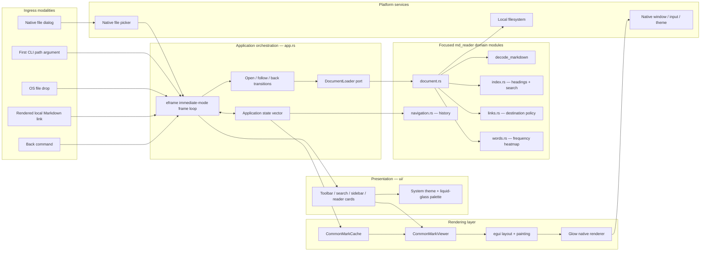

### Architectural layers

| Layer | Responsibility | Principal symbols |
|---|---|---|
| Platform | Windowing, input, native selection, filesystem access | `eframe`, `rfd`, `std::fs` |
| Presentation | Compose toolbar, cards, responsive drawer, reader, errors, and empty state | `ui::components`, `ui::theme` |
| Rendering | Parse and paint CommonMark, images, anchors, and link hooks | `CommonMarkViewer`, `CommonMarkCache` |
| Application | Own session state and coordinate successful opens, local traversal, back, shortcuts, and layout selection | `MdReaderApp`, `install_document`, `apply_actions` |
| Domain | Validate paths, decode bytes, index headings, search sections, classify destinations, analyze words, manage history | `document`, `index`, `links`, `words`, `navigation` |

### SOLID without a ceremonial enterprise framework

| Principle | Concrete application |
|---|---|
| Single Responsibility | Each module has one reason to change: filesystem loading, indexing, links, history, word analysis, state orchestration, component composition, or visual styling. |
| Open/Closed | A new `DocumentLoader` can be introduced without modifying navigation or rendering logic; sidebar content remains selected through a small enum. |
| Liskov Substitution | Any `DocumentLoader` implementation honoring `load(&Path)` can replace `FileDocumentLoader` without changing `MdReaderApp` behavior. |
| Interface Segregation | `DocumentLoader` exposes one operation rather than a broad repository/service interface. UI helpers receive only the state they render. |
| Dependency Inversion | The app depends on the loader capability; `FileDocumentLoader` supplies the concrete filesystem policy at the composition root. |
| KISS | There is one trait at an actual external boundary, no container, no event bus, no abstract widget hierarchy, and no framework built around the framework. |

### Dependency topology

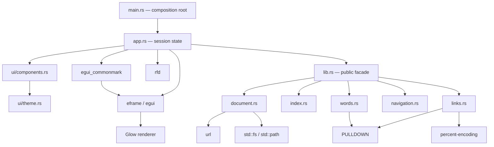

---

## Formal State Model

The live application state is represented by:

```text
MdReaderApp {
    loader: Box<dyn DocumentLoader>,
    document: Option<LoadedDocument>,
    markdown_cache: CommonMarkCache,
    history: NavigationHistory,
    error_message: Option<String>,
    current_scroll_offset: f32,
    restore_scroll_offset: Option<f32>,
    sidebar_open: bool,
    sidebar_tab: SidebarTab,
    search_open: bool,
    search_query: String,
    font_scale: f32,
}
```

We define the document representation as:

$$
D = \langle p, m, X, W, b, I \rangle
$$

where:

- $p$ is the absolute document path,
- $m$ is the decoded Markdown string,
- $X$ is the in-memory heading index and anchor-augmented render Markdown,
- $W$ is the visible-word frequency and heatmap state,
- $b$ is the directory URI used as the base for relative images,
- $I$ is the sorted, deduplicated set of intercepted link destinations.

A history entry is:

$$
N_i = \langle p_i, y_i \rangle
$$

where $p_i$ is a previously viewed document path and $y_i$ is its last observed vertical scroll offset.

### State transitions

#### Explicit open

An explicit open comes from the CLI, file picker, or drag-and-drop.

$$
OpenExplicit(p):
\begin{cases}
D' = Load(p) \\
H' = \varnothing \\
y' = 0 \\
r' = 0 \\
E' = \varnothing
\end{cases}
$$

If loading fails, only the error state changes; the currently displayed document is retained.

#### Local-link traversal

$$
Follow(p'):
\begin{cases}
D' = Load(p') \\
H' = H \Vert \langle D.p, y \rangle \\
y' = 0 \\
r' = 0 \\
E' = \varnothing
\end{cases}
$$

The history append occurs only after `Load(p')` succeeds.

#### Back-navigation

For the last history entry $\langle p_h, y_h \rangle$:

$$
Back():
\begin{cases}
D' = Load(p_h) \\
H' = pop(H) \\
y' = y_h \\
r' = y_h \\
E' = \varnothing
\end{cases}
$$

The history pop occurs only after the prior document has been reloaded successfully.

### Application state topology

```mermaid
stateDiagram-v2
    [*] --> Empty

    Empty --> Loading: CLI path / Open / Drop
    Loading --> Displaying: load_document = Ok
    Loading --> EmptyWithError: load_document = Err and no document

    EmptyWithError --> Loading: retry open
    EmptyWithError --> EmptyWithError: invalid drop

    Displaying --> LoadingReplacement: explicit open or valid drop
    LoadingReplacement --> Displaying: success; clear history
    LoadingReplacement --> DisplayingWithError: failure; retain document

    Displaying --> LoadingLinked: click local .md link
    LoadingLinked --> Displaying: success; push current path + scroll
    LoadingLinked --> DisplayingWithError: failure; retain document/history

    Displaying --> LoadingBack: Back / Alt+Left
    LoadingBack --> Displaying: success; pop history + restore scroll
    LoadingBack --> DisplayingWithError: failure; retain history

    DisplayingWithError --> LoadingReplacement: explicit retry
    DisplayingWithError --> LoadingLinked: another local link
    DisplayingWithError --> LoadingBack: back retry
    DisplayingWithError --> Displaying: next successful install clears error
```

> The real code stores the error as an overlay field rather than as a mutually exclusive state. The diagram expands that overlay into named states to make the transition semantics visible.

---

## Document Acquisition Pipeline

Loading a document is a staged transformation from a user-selected path to a renderer-ready immutable payload.

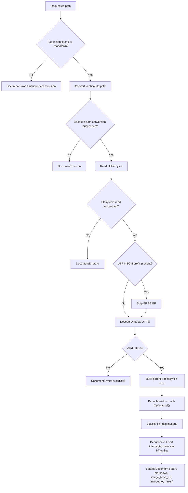

### Acquisition algorithm

```rust
fn conceptual_load(path):
    reject path unless extension is md or markdown
    absolute_path = make_absolute(path)
    bytes = read_entire_file(absolute_path)
    bytes = strip_optional_utf8_bom(bytes)
    markdown = decode_utf8(bytes)
    image_base_uri = parent_directory_as_file_uri(absolute_path)
    intercepted_links = parse_classify_sort_and_deduplicate(markdown)
    return LoadedDocument(...)
```

### Why the base URI matters

A Markdown file commonly references nearby assets:

```markdown

```

MD Reader derives a `file:///.../document-directory/` URI and supplies it as the viewer’s default implicit URI scheme. Relative image references can therefore be resolved against the opened document’s directory rather than the process working directory.

### Decode semantics

| Input | Result |
|---|---|
| Valid UTF-8 | Accepted |
| Valid UTF-8 with `EF BB BF` BOM | BOM removed, then accepted |
| Invalid UTF-8 | Rejected with `InvalidUtf8` |
| UTF-16 / legacy code page | Rejected unless converted to UTF-8 first |

---

## Hyperlink Classification Automaton

MD Reader does not treat every destination equally. It explicitly divides links into four semantic classes:

```rust
pub enum LinkKind {
    Anchor,
    LocalMarkdown(PathBuf),
    External,
    Inactive,
}
```

### Decision graph

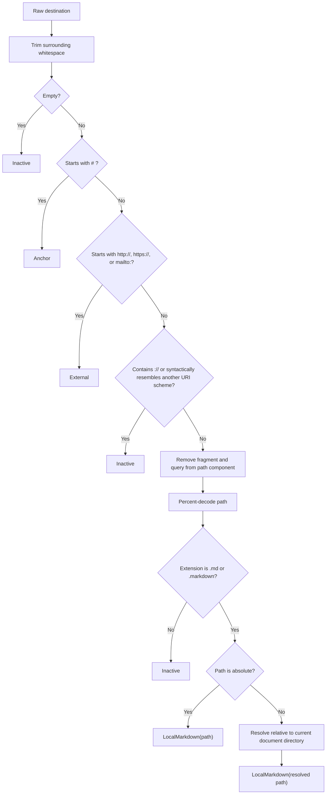

### Classification matrix

| Destination example | Class | Application behavior |
|---|---|---|
| `#overview` | `Anchor` | Viewer-managed heading navigation |
| `https://example.com` | `External` | Not intercepted by the local navigation engine |
| `http://example.com` | `External` | Not intercepted by the local navigation engine |
| `mailto:reader@example.com` | `External` | Not intercepted by the local navigation engine |
| `chapter.md` | `LocalMarkdown` | Resolve relative to current file and open |
| `chapter.markdown` | `LocalMarkdown` | Resolve relative to current file and open |
| `chapter%20one.md#start` | `LocalMarkdown` | Decode path and open `chapter one.md` |
| `/absolute/notes.md` | `LocalMarkdown` where the target platform treats it as absolute | Use the path directly rather than joining it to the current directory |
| `notes.txt` | `Inactive` | Hooked, but no navigation is performed |
| `file:///tmp/notes.md` | `Inactive` | URI-like destination is not followed by local path logic |
| `javascript:alert(1)` | `Inactive` | Explicitly treated as inactive |
| `custom-scheme:payload` | `Inactive` | Unknown URI scheme is inactive |
| empty destination | `Inactive` | No action |

### Interception policy

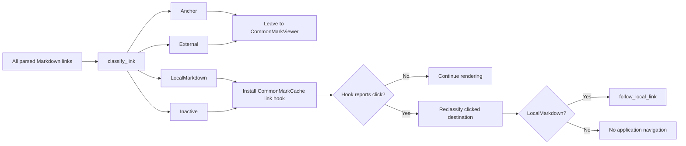

The interception list is built with a `BTreeSet`, which gives the application a deterministic, sorted, duplicate-free destination vector.

---

## Transactional Navigation Protocol

Navigation is intentionally structured so that failed filesystem operations do not corrupt the current reading session.

### Local-link traversal sequence

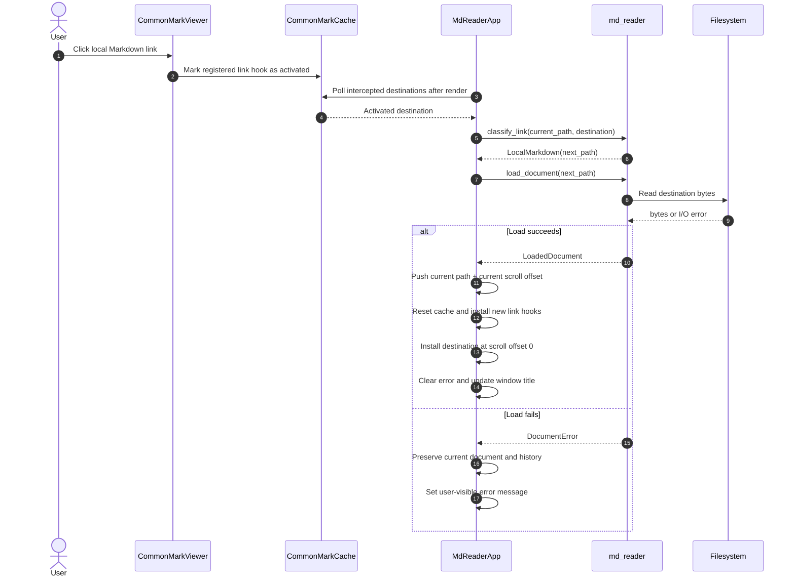

### Back-navigation sequence

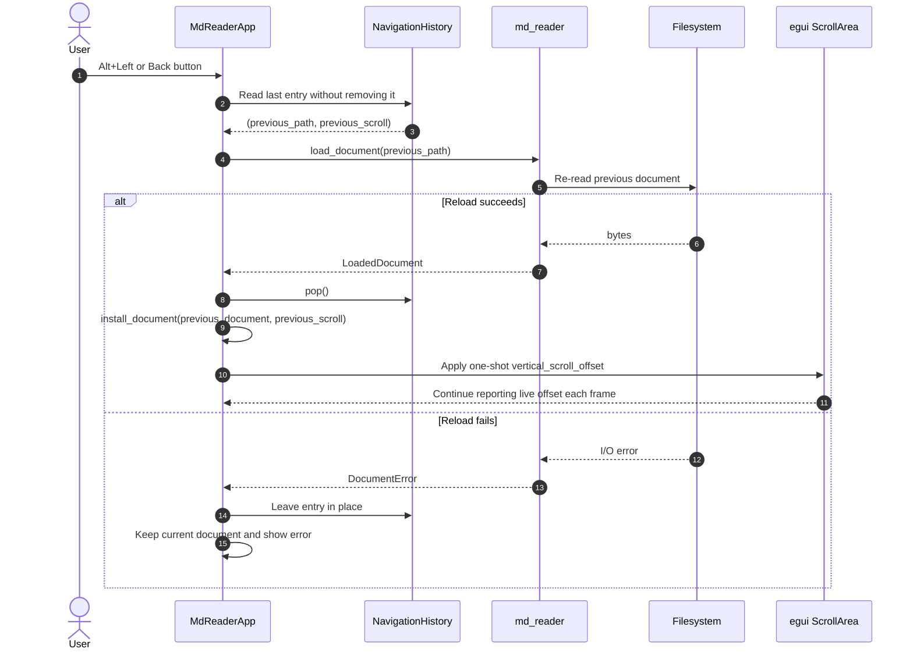

### Navigation graph semantics

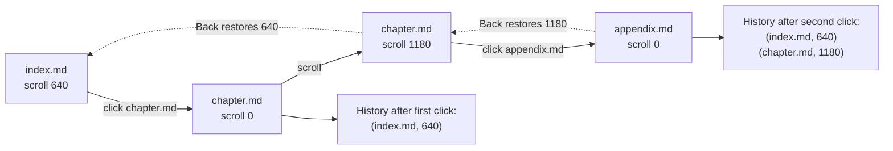

### Session boundary rule

An **explicit open**—CLI, picker, or drop—starts a new navigation session and clears history. A **local-link open** extends the current session and pushes the previous location.

This distinction keeps the Back button semantically aligned with in-document-graph exploration rather than becoming a global recent-files list.

---

## Frame Execution Model

`MdReaderApp` is an immediate-mode UI application. Every frame reevaluates input, composes the interface, renders the document, and then commits requested actions.

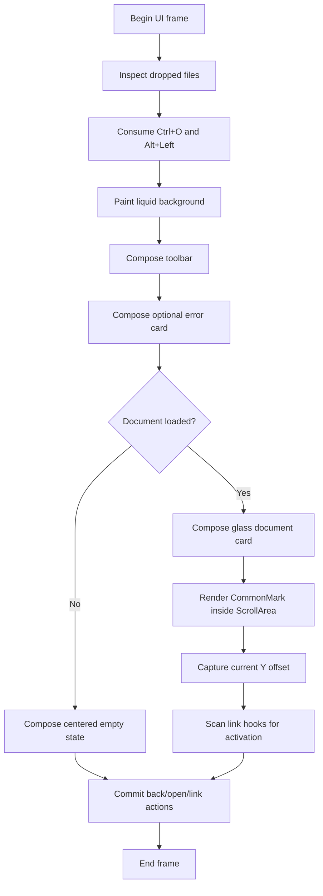

### Why actions are committed after composition

The frame first collects intent into local flags such as `toolbar_open`, `toolbar_back`, `empty_open`, and `clicked_link`. It then performs file dialogs and navigation after the UI composition block. This keeps mutation points concentrated and avoids changing the active document in the middle of its own rendering pass.

### Input convergence

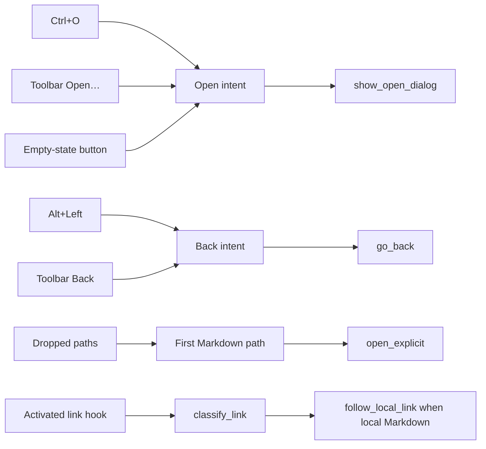

---

## Visual System

The application uses `ThemePreference::System` and then customizes both light and dark `egui` style trees.

### UI composition graph

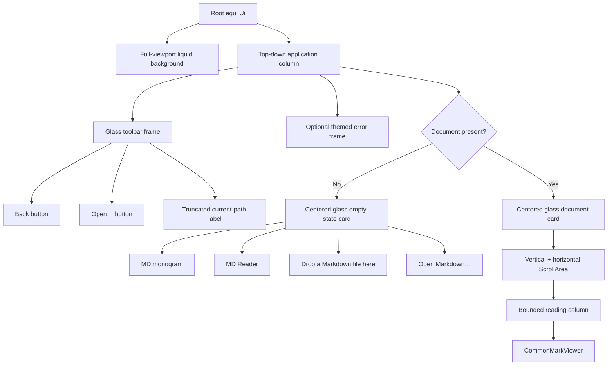

### Window geometry

| Parameter | Value | Purpose |
|---|---:|---|
| Default window size | `960 × 720` | Comfortable initial reading surface |
| Minimum window size | `480 × 320` | Prevent unusably small layout |
| Maximum reading width | `980 px` | Bound text measure on large windows |
| Maximum document-card width | `1080 px` | Preserve visual hierarchy and margins |
| Empty-state target width | `440 px` | Compact centered call-to-action |
| Empty-state target height | `208 px` | Stable visual footprint |

### Typography

| Text style | Size | Family |
|---|---:|---|
| Body | `16 px` | Proportional |
| Monospace | `14 px` | Monospace |
| Button | `14 px` | Proportional |

### Theme adaptation

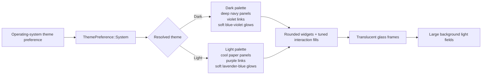

### Liquid-background model

The background is not a texture or shader. It is a deliberately lightweight composition:

1. Fill the available viewport with the theme’s base color.
2. Paint one large translucent violet circle near the upper-left region.
3. Paint one larger translucent blue circle near the lower-right region.
4. Place semi-opaque rounded content frames above the fields.

This produces a glass-like visual system without introducing a custom GPU pipeline.

### Responsive document layout

The document card width is derived from available width and clamped to a maximum. The reader content receives its own bound, while horizontal scrolling remains enabled for wide code blocks or content that cannot wrap safely.

Rendered images are assigned a maximum width derived from the current reading width, preventing ordinary images from expanding beyond the reading column.

When the sidebar is enabled, a fixed-width vertical surface exposes **Outline** and **Word Heatmap** tabs. Outline lists H1–H6 entries with level-based indentation; Word Heatmap shows the log-scaled lexical field. The document keeps the remaining horizontal space, and selecting an outline entry requests an anchor scroll in the same viewer.

The Search panel appears beneath the toolbar. It searches the original Markdown case-insensitively, reports the full match count, displays at most 100 matching section snippets, and navigates to a section anchor when one exists.

### Reading controls

The toolbar stays compact: **Back**, **Open**, **Outline**, **Search**, **Aa**, and the current path. The Outline button toggles the two-tab document sidebar; Search and Aa remain independent controls. Outline, Search and Aa are disabled until a document is open. Text scaling is session-local and applies to body, monospace and heading styles from `80%` through `150%`; `Ctrl+0` restores `100%`.

---

## Lexical Thermodynamics and the Word-Frequency Projection Subsystem

> [!IMPORTANT]
> This chapter documents a sidebar that counts words. It is intentionally written as though the sidebar were a national laboratory operating a sparse statistical instrument under treaty supervision.

The **Word Heatmap** tab answers a question that could fit in one sentence:

> Which visible words occur most often in the current Markdown document?

The implementation answers that question with a deterministic parser pass, Unicode-aware normalization, an ordered frequency map, a logarithmic transfer function, and a two-column field of colored native widgets. The documentation answers the same question with linear algebra, graph theory, information theory, machine-learning counterfactuals, spectral geometry, a threat model, several diagrams, and enough notation to make the feature appear eligible for research funding.

### Operational summary

```mermaid
flowchart LR
    SOURCE["UTF-8 Markdown"] --> PARSER["pulldown-cmark events"]
    PARSER --> VISIBLE["Text + inline code payloads"]
    VISIBLE --> TOKENS["Unicode-aware lexical tokens"]
    TOKENS --> COUNTS["BTreeMap frequency counts"]
    COUNTS --> VECTOR["Count vector c"]
    VECTOR --> LOG["log-normalized heat h"]
    LOG --> COLOR["theme-conditioned RGB interpolation"]
    COLOR --> GRID["Word Heatmap sidebar tab"]
```

| Stage | Actual implementation | Ceremonial description |
|---|---|---|
| Parse | Iterate `pulldown_cmark::Event` values | Project the source into a renderer-visible semantic manifold |
| Select | Accept `Text` and `Code` events | Apply the observability operator to the event stream |
| Tokenize | Split at non-alphanumeric characters except apostrophes | Construct a Unicode lexical basis |
| Normalize | Lowercase each scalar value | Collapse case-equivalent orbits |
| Validate | Keep tokens containing at least one alphabetic character | Reject numerically degenerate pseudo-lexemes |
| Count | Increment a `BTreeMap<String, usize>` | Accumulate a sparse nonnegative measure |
| Sort | Count descending, lexical order for ties | Establish a deterministic total order over the vocabulary |
| Heat | `ln(1 + count) / ln(1 + max_count)` | Apply a concave perceptual transfer operator |
| Render | Interpolate between cold and hot theme colors | Materialize lexical energy on the native reading surface |

### User-facing contract

The heatmap is not a sentiment model, topic model, spell checker, language detector, embedding model, authorship classifier, or oracle. It is a direct frequency view with intentionally transparent semantics.

| Property | Behavior |
|---|---|
| Activation | Open the sidebar with **Outline**, then select **Word Heatmap** |
| Source | Original Markdown parsed with `Options::all()` |
| Counted payloads | Visible text and code payload events |
| Excluded syntax | Markdown punctuation and link destinations |
| Case | Unicode lowercase normalization |
| Pure numbers | Excluded because a retained token must contain a letter |
| Ordering | Descending count, then ascending word |
| Full vocabulary | Retained in memory for the active document |
| Display cap | First 240 entries |
| Intensity | Log-normalized against the most frequent word |
| Tooltip | Word, occurrence count, total-word share, normalized heat |
| Persistence | None; recomputed when a document is loaded |
| Network | None |
| Machine learning | Absolutely none, despite later sections trying very hard |

### Lexical observation operator

Let the Markdown parser produce an event sequence:

$$
E = \langle e_1, e_2, \ldots, e_m \rangle
$$

Define a visibility selector $V(e)$:

$$
V(e) =
\begin{cases}
x, & e = Text(x) \\
x, & e = Code(x) \\
\epsilon, & otherwise
\end{cases}
$$

Concatenating non-empty observations gives the lexical source stream:

$$
L = V(e_1) \Vert V(e_2) \Vert \cdots \Vert V(e_m)
$$

The notation is deliberately grander than the code:

```rust
for event in Parser::new_ext(markdown, Options::all()) {
    if let Event::Text(text) | Event::Code(text) = event {
        collect_words(&text, &mut counts, &mut total_words);
    }
}
```

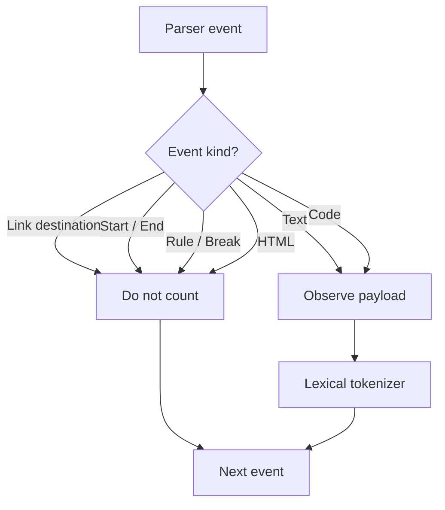

This distinction matters. In:

```markdown
[Rust](https://www.rust-lang.org/)
```

the word `rust` is visible and counted. The destination components `https`, `www`, `lang`, and `org` are not visible reader text and are not counted.

### Tokenization as a finite-state machine

The tokenizer maintains one mutable string buffer. Each Unicode scalar value causes one of three transitions:

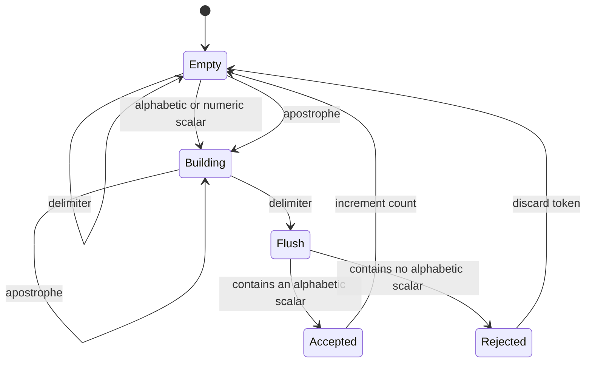

For a token candidate $s$, retention is:

$$
keep(s) = \bigvee_{x \in s} alphabetic(x)
$$

Examples:

| Input fragment | Normalized tokens | Notes |
|---|---|---|
| `Rust rust RUST` | `rust`, `rust`, `rust` | Case orbit collapsed |
| `reader's` | `reader's` | Interior apostrophe preserved |
| `'quoted'` | `quoted` | Boundary apostrophes trimmed |
| `C3PO` | `c3po` | Alphanumeric token contains letters |
| `2026` | none | Purely numeric candidate rejected |
| `Italy—art` | `italy`, `art` | Em dash is a delimiter |
| `state-of-the-art` | `state`, `of`, `the`, `art` | Hyphens are delimiters |
| `Италия ИТАЛИЯ` | `италия`, `италия` | Unicode lowercase normalization |

### Vocabulary construction

Suppose the accepted normalized token stream is:

$$
T = \langle t_1, t_2, \ldots, t_N \rangle
$$

and its unique vocabulary is:

$$
\Omega = \{w_1, w_2, \ldots, w_d\}
$$

Each vocabulary item defines a basis direction. The one-hot encoding of token $t_k$ is:

$$
\mathbf{e}(t_k) \in \{0,1\}^{d}
$$

with exactly one nonzero coordinate. The complete frequency vector is therefore:

$$
\mathbf{c} = \sum_{k=1}^{N} \mathbf{e}(t_k)
$$

or, coordinate-wise:

$$
c_i = \sum_{k=1}^{N} [t_k = w_i]
$$

where the bracket evaluates to one when the proposition is true and zero otherwise.

This is the README's central act of linear-algebraic inflation. The Rust implementation increments an integer in a map.

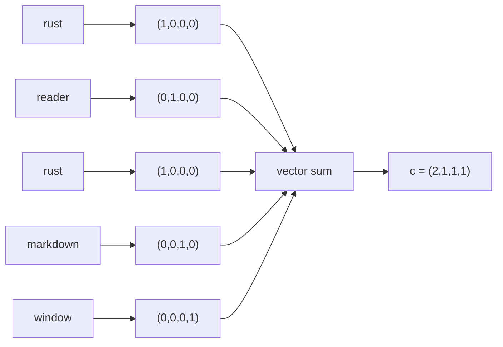

### Sparse representation

A dense vector reserves one coordinate for every vocabulary item. MD Reader instead stores only observed coordinates:

```text
Dense ceremonial vector:
    [0, 0, 0, 7, 0, 0, 2, 0, 0, 1, ...]

Actual ordered map:
    "markdown" -> 7
    "reader"   -> 2
    "rust"     -> 1
```

Let $d = |\Omega|$. The dense storage cost is proportional to $d$ even before counts exist. The map stores exactly $d$ observed words because the vocabulary is created from observations; the real benefit is not avoiding unobserved dictionary words but preserving deterministic keys without inventing a language-wide coordinate system.

| Representation | Memory shape | Ordering | Used? |
|---|---|---|---|
| Dense array over a global dictionary | $O(D)$ | dictionary-defined | No |
| Hash map | $O(d)$ | nondeterministic without sorting | No |
| B-tree map | $O(d)$ | lexical iteration | Yes |
| Sparse compressed vector | $O(d)$ | coordinate-defined | No |
| GPU tensor | excessive | device-defined | Mercifully no |

### Count vector norms

Several norms can be computed from $\mathbf{c}$:

$$
\|\mathbf{c}\|_1 = \sum_{i=1}^{d} c_i = N
$$

$$
\|\mathbf{c}\|_2 = \sqrt{\sum_{i=1}^{d} c_i^2}
$$

$$
\|\mathbf{c}\|_{\infty} = \max_i c_i = c_{max}
$$

MD Reader directly uses the $L_1$ interpretation for `total_words` and the $L_\infty$ interpretation for heat normalization. The Euclidean norm is included because a linear-algebra section without it would fail inspection.

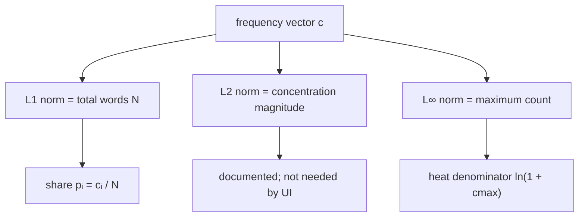

### Probability simplex projection

Dividing by the total token count projects the count vector onto the probability simplex:

$$
\mathbf{p} = \frac{\mathbf{c}}{\|\mathbf{c}\|_1}
$$

with:

$$
p_i \ge 0
$$

and:

$$
\sum_{i=1}^{d} p_i = 1
$$

The UI exposes $100p_i$ in each tile's tooltip. No Bayesian interpretation is implied. A word with a share of `4.25%` simply accounts for that fraction of accepted visible tokens.

### Why raw counts make bad color

Natural-language frequency distributions are uneven. Function words can appear many times while most content words appear once. A linear mapping:

$$
h_i^{linear} = \frac{c_i}{c_{max}}
$$

compresses most vocabulary items near zero whenever one word dominates. For counts `[1, 2, 4, 8, 32]`, linear heat becomes approximately `[0.03, 0.06, 0.13, 0.25, 1.00]`.

The implemented concave transfer function is:

$$
h_i = \frac{\ln(1 + c_i)}{\ln(1 + c_{max})}
$$

For the same counts, the heat values become approximately `[0.20, 0.31, 0.46, 0.63, 1.00]`. Rare words remain visibly distinct while the maximum still maps to one.

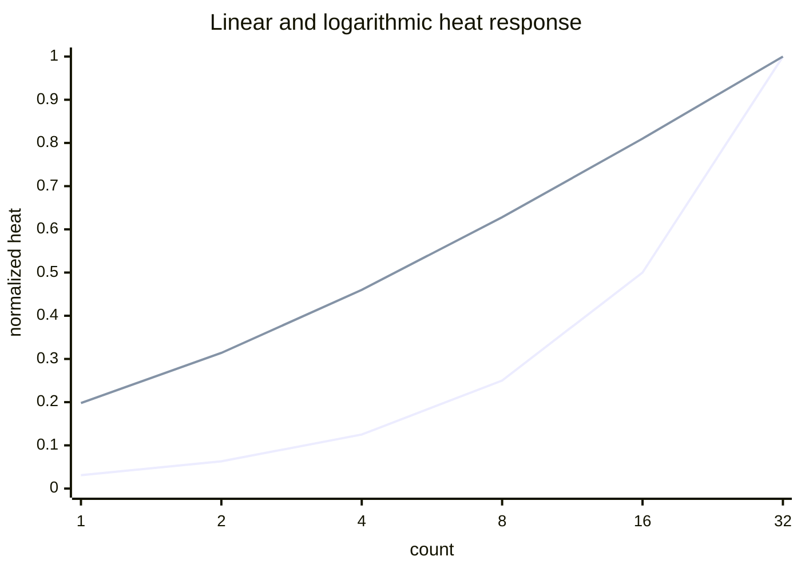

> [!NOTE]
> The `xychart-beta` diagram is documentation. The application computes the logarithm but does not embed a plotting package, scientific runtime, BLAS implementation, or small university mathematics department.

### Transfer-function properties

For $c_i \ge 1$ and $c_{max} \ge 1$:

1. $0 < h_i \le 1$.
2. $h_i = 1$ exactly when $c_i = c_{max}$.
3. If $c_a < c_b$, then $h_a < h_b$.
4. The derivative decreases as the count grows.
5. Equal counts produce equal colors before theme transformation.

The derivative of the unnormalized numerator is:

$$
\frac{d}{dc}\ln(1+c) = \frac{1}{1+c}
$$

The second derivative is negative:

$$
\frac{d^2}{dc^2}\ln(1+c) = -\frac{1}{(1+c)^2}
$$

Therefore the response is monotone and concave. In normal language: every additional repetition increases heat, but the visual reward for the thousandth repetition is smaller than the reward for the second.

### Theme-conditioned color projection

The scalar heat value is converted into a color by channel-wise interpolation between a cold color $\mathbf{a}$ and a hot color $\mathbf{b}$:

$$
\mathbf{q}(h) = (1-h)\mathbf{a} + h\mathbf{b}
$$

For each RGB channel $j$:

$$
q_j(h) = a_j + (b_j-a_j)h
$$

The endpoints are theme-specific:

| Theme | Cold RGB | Hot RGB | Intent |
|---|---|---|---|
| Dark | `(43, 47, 66)` | `(116, 88, 222)` | muted graphite to violet |
| Light | `(237, 239, 248)` | `(190, 169, 255)` | cool paper to lavender |

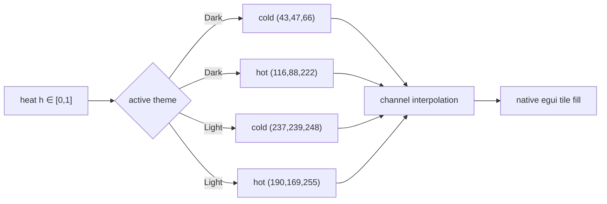

### Deterministic ordering protocol

Frequency heat alone does not define a stable list because several words can share a count. The ordering relation is lexicographic over the pair:

$$
key(w_i) = (-c_i, w_i)
$$

That means:

1. Greater counts appear first.
2. Equal counts are ordered alphabetically.
3. The same document produces the same sequence across runs.

```mermaid
flowchart TD
    A["Compare two entries a and b"] --> COUNT{"count(a) = count(b)?"}
    COUNT -- No --> DESC["larger count first"]
    COUNT -- Yes --> WORD["smaller lexical word first"]
    DESC --> ORDER["deterministic total order"]
    WORD --> ORDER
```

Worked ordering example:

| Word | Count | Primary rank | Tie rank | Final position |
|---|---:|---:|---:|---:|
| `reader` | 8 | 1 | 1 | 1 |
| `rust` | 8 | 1 | 2 | 2 |
| `document` | 3 | 2 | 1 | 3 |
| `markdown` | 3 | 2 | 2 | 4 |
| `window` | 1 | 3 | 1 | 5 |

### Sidebar composition

The existing sidebar is now a two-state surface:

```mermaid
stateDiagram-v2
    [*] --> Closed
    Closed --> Outline: toolbar Outline
    Outline --> Closed: toolbar Outline
    Outline --> WordHeatmap: select Word Heatmap tab
    WordHeatmap --> Outline: select Outline tab
    WordHeatmap --> Closed: toolbar Outline
    Closed --> Outline: open another document resets tab
```

The sidebar layout is:

```text
┌──────────────────────────────────────┐
│ Outline │ Word Heatmap               │
├──────────────────────────────────────┤
│ 1284 words · 412 unique              │
│ visible text · logarithmic intensity │
│ rare  ░ ▒ ▓ █  frequent             │
│                                      │
│ ┌────────────┐ ┌────────────┐        │
│ │ the · 83   │ │ markdown 51│        │
│ └────────────┘ └────────────┘        │
│ ┌────────────┐ ┌────────────┐        │
│ │ reader · 44│ │ document 37│        │
│ └────────────┘ └────────────┘        │
│                 ⋮                    │
└──────────────────────────────────────┘
```

Each tile is a fixed-height native button used as a compact colored surface. Clicking a heat tile has no semantic effect. Hovering reveals the full word, count, share, and heat value.

### Display cap and full-state distinction

The analysis retains all $d$ vocabulary entries. Rendering is bounded:

$$
d_{rendered} = \min(d, 240)
$$

The cap protects the immediate-mode UI from constructing an arbitrarily large widget grid every frame. It does not alter:

- total word count,
- unique word count,
- maximum count,
- per-word shares,
- heat normalization,
- the in-memory sorted vocabulary.

```mermaid
flowchart LR
    ALL["all d entries in WordHeatmap"] --> SORT["sorted frequency vector"]
    SORT --> TAKE["take first min(d,240)"]
    TAKE --> GRID["two-column widget grid"]
    ALL --> METRICS["total + unique metrics"]
```

### Complexity envelope

Let:

- $n$ be the number of Unicode scalar values in visible parser payloads,
- $N$ be the accepted token count,
- $d$ be the number of unique words.

The principal costs are:

| Operation | Cost | Explanation |
|---|---:|---|
| Parser traversal | $O(n)$ | Each parser payload is visited |
| Token normalization | $O(n)$ | Each scalar is classified and lowercased |
| B-tree insertion | $O(N \log d)$ | Each token updates an ordered map |
| Entry construction | $O(d)$ | Shares and heat values are computed once |
| Frequency sort | $O(d \log d)$ | Count-descending output order |
| Sidebar rendering | $O(\min(d,240))$ per frame | Bounded tile grid |
| Analysis memory | $O(d + \sum |w_i|)$ | Stored words and statistics |

The end-to-end load-time bound is:

$$
O(n + N\log d + d\log d)
$$

For ordinary prose, $N \le n$ and $d \le N$, so the implementation remains thoroughly unworthy of distributed computing.

```mermaid
flowchart TB
    N["n visible characters"] --> TOKEN["O(n) tokenization"]
    TOKENS["N accepted tokens"] --> MAP["O(N log d) B-tree updates"]
    D["d unique words"] --> SORT["O(d log d) ordering"]
    SORT --> RENDER["O(min(d,240)) per frame"]
```

### Load-time lifecycle

The heatmap is computed alongside the heading index, before the `LoadedDocument` is installed:

```mermaid
sequenceDiagram
    participant U as User
    participant A as MdReaderApp
    participant L as load_document
    participant P as Markdown parser
    participant W as build_word_heatmap
    participant S as Sidebar

    U->>A: Open path
    A->>L: load_document(path)
    L->>L: validate extension + UTF-8
    L->>P: build_document_index(markdown)
    L->>W: build_word_heatmap(markdown)
    W->>P: iterate visible events
    P-->>W: Text / Code payloads
    W-->>L: WordHeatmap { total, entries }
    L-->>A: LoadedDocument
    A->>A: install document atomically
    U->>S: select Word Heatmap
    S->>S: render bounded tile projection
```

Because analysis occurs before installation, a failed file load does not partially replace the active document with an empty or mismatched heatmap.

### Correctness invariants of the lexical subsystem

#### Lexical invariant 1 — total conservation

If every accepted token increments exactly one vocabulary coordinate, then:

$$
\sum_{i=1}^{d} c_i = N
$$

The implementation increments `total_words` in the same branch that increments the map entry.

#### Lexical invariant 2 — maximum heat

For a non-empty document:

$$
\max_i h_i = 1
$$

The test suite explicitly verifies that the most frequent word receives heat `1.0`.

#### Lexical invariant 3 — case collapse

For case variants $x_1, x_2, \ldots$ whose Unicode lowercase mappings are equal:

$$
lower(x_1) = lower(x_2) \Rightarrow coordinate(x_1) = coordinate(x_2)
$$

#### Lexical invariant 4 — syntax non-observability

If a string occurs only in a link destination and never in a `Text` or `Code` event, its count is zero.

#### Lexical invariant 5 — deterministic tie resolution

For equal counts:

$$
c_a = c_b \land a < b \Rightarrow rank(a) < rank(b)
$$

#### Lexical invariant 6 — bounded rendering

The number of heat tiles in one frame never exceeds 240 even if the vocabulary is much larger.

```mermaid
flowchart LR
    CONSERVE["Σcᵢ = N"] --> TRUST["auditable counts"]
    MAX["max hᵢ = 1"] --> TRUST
    CASE["case variants collapse"] --> TRUST
    SYNTAX["destinations excluded"] --> TRUST
    ORDER["ties deterministic"] --> TRUST
    CAP["tiles ≤ 240"] --> RESPONSIVE["bounded frame work"]
```

### Information-theoretic quantities we could compute but do not need

Once $\mathbf{p}$ exists, Shannon entropy is available:

$$
H(\mathbf{p}) = -\sum_{i=1}^{d} p_i \log_2 p_i
$$

The maximum possible entropy for a vocabulary of size $d$ is:

$$
H_{max} = \log_2 d
$$

Normalized lexical entropy would be:

$$
H_{norm} = \frac{H(\mathbf{p})}{\log_2 d}
$$

This could describe whether a document reuses a small vocabulary or distributes mass more evenly. It is not required to answer “how many times did this word occur,” so MD Reader does not display it. The intellectual ancestry of this equation is Claude Shannon's 1948 paper, [*A Mathematical Theory of Communication*](https://onlinelibrary.wiley.com/doi/10.1002/j.1538-7305.1948.tb00917.x).

```mermaid
flowchart TD
    P["probability vector p"] --> ENTROPY["Shannon entropy H(p)"]
    ENTROPY --> LOW["low: concentrated vocabulary"]
    ENTROPY --> HIGH["high: distributed vocabulary"]
    LOW --> UNUSED["not currently displayed"]
    HIGH --> UNUSED
```

### Term weighting: the multi-document empire we refuse to build

Within one document, frequency is direct:

$$
tf(w,d) = count(w,d)
$$

Across a collection of $M$ documents, inverse document frequency could be:

$$
idf(w) = \log\frac{M}{1 + df(w)}
$$

and a combined weight:

$$
tfidf(w,d) = tf(w,d) \cdot idf(w)
$$

Term weighting has a long information-retrieval history; Gerard Salton and Chris Buckley's 1988 article [*Term-Weighting Approaches in Automatic Text Retrieval*](https://doi.org/10.1016/0306-4573(88)90021-0) is an appropriate primary reference.

MD Reader intentionally has no library, corpus, workspace index, or persistent document collection, so $M=1$ and document-frequency theatre would add machinery without useful discrimination.

```mermaid
flowchart LR
    CURRENT["Current design<br/>one document"] --> TF["term frequency"]
    CORPUS["Hypothetical corpus<br/>M documents"] --> DF["document frequency"]
    TF --> HEAT["local heatmap"]
    TF --> TFIDF["TF-IDF"]
    DF --> TFIDF
    TFIDF --> NOTNOW["not part of MD Reader"]
```

### Co-occurrence matrix counterfactual

For a token window radius $r$, define a co-occurrence matrix $X \in \mathbb{N}^{d \times d}$:

$$
X_{ij} = \sum_{k=1}^{N} [t_k=w_i] \sum_{q=-r}^{r} [q \ne 0][t_{k+q}=w_j]
$$

This matrix can encode which words appear near one another. It is not needed for a frequency heatmap, but once the README has introduced a matrix, it can responsibly overreact to it.

```mermaid
flowchart LR
    STREAM["token stream"] --> WINDOWS["sliding context windows"]
    WINDOWS --> COOCCUR["co-occurrence matrix X"]
    COOCCUR --> SVD["truncated SVD"]
    COOCCUR --> GLOVE["weighted log-bilinear model"]
    COOCCUR --> GRAPH["weighted word graph"]
    SVD --> EMBED["semantic coordinates"]
    GLOVE --> EMBED
    GRAPH --> EMBED
    EMBED --> ABSURD["wildly outside current scope"]
```

Global co-occurrence statistics underpin models such as GloVe; see Pennington, Socher, and Manning's [*GloVe: Global Vectors for Word Representation*](https://aclanthology.org/D14-1162/). MD Reader does not train embeddings while opening your grocery list.

### Singular-value decomposition, because the matrix is already here

If $X$ existed, a factorization could be written:

$$
X = U\Sigma V^{\top}
$$

A rank-$k$ approximation would be:

$$
X_k = U_k\Sigma_k V_k^{\top}
$$

This could reduce a high-dimensional co-occurrence structure to $k$ latent directions. The current implementation has no co-occurrence matrix and therefore performs no SVD. The equation is present solely because the feature request explicitly authorized linear algebra and the README had unused vertical space.

### Cosine similarity between hypothetical documents

Given two count or weighted vectors $\mathbf{x}$ and $\mathbf{y}$:

$$
cos(\mathbf{x},\mathbf{y}) = \frac{\mathbf{x}^{\top}\mathbf{y}}{\|\mathbf{x}\|_2\|\mathbf{y}\|_2}
$$

| Value | Interpretation |
|---:|---|
| `1` | identical direction in the selected vocabulary space |
| near `1` | strongly similar distributions |
| near `0` | little coordinate overlap |
| negative | impossible for raw nonnegative counts, possible for centered embeddings |

MD Reader opens one document at a time, so it has nobody to compare the active document with. This is both a limitation and a triumph of restraint.

### Word-graph construction

The hypothetical co-occurrence matrix can be interpreted as a graph:

$$
G = (\Omega, E, X)
$$

where words are vertices and positive co-occurrence values are weighted edges.

```mermaid
graph TD
    MARKDOWN((markdown)) --- READER((reader))
    MARKDOWN --- DOCUMENT((document))
    MARKDOWN --- TABLE((table))
    READER --- WINDOW((window))
    READER --- DOCUMENT
    DOCUMENT --- LINK((link))
    DOCUMENT --- HEADING((heading))
    HEADING --- OUTLINE((outline))
    OUTLINE --- SEARCH((search))
    SEARCH --- WORD((word))
    WORD --- HEATMAP((heatmap))
```

One could then compute eigenvector centrality or PageRank-like scores. The original Google system famously used link structure and an eigenvector-style importance measure; Brin and Page's Stanford-hosted paper [*The Anatomy of a Large-Scale Hypertextual Web Search Engine*](https://infolab.stanford.edu/~backrub/google.html) provides the relevant historical context.

For a word heatmap, recursive authority is unnecessary. The word `the` does not become more meaningful because it co-occurs with `markdown`.

### Random-walk formulation that nobody requested

Let $P$ be a row-normalized co-occurrence transition matrix. A lexical random walk would evolve as:

$$
\mathbf{r}_{t+1} = \alpha P^{\top}\mathbf{r}_t + (1-\alpha)\mathbf{u}
$$

where $\mathbf{u}$ is a restart distribution. At convergence:

$$
\mathbf{r}^{*} = \alpha P^{\top}\mathbf{r}^{*} + (1-\alpha)\mathbf{u}
$$

```mermaid
flowchart LR
    START["restart distribution u"] --> WALK["lexical random walk"]
    WALK --> WORD1["markdown"]
    WORD1 --> WORD2["reader"]
    WORD2 --> WORD3["document"]
    WORD3 --> BORED{"restart?"}
    BORED -- no --> WALK
    BORED -- yes --> START
```

This process is not implemented. The heatmap uses count, which requires neither convergence tolerance nor a philosophical model of a bored reader wandering among nouns.

### Random forests: an aggressively unnecessary design review

Leo Breiman defined random forests as ensembles of randomized tree predictors; the primary paper is [*Random Forests*](https://doi.org/10.1023/A:1010933404324), published in *Machine Learning* in 2001.

We could fabricate a feature vector for each word:

$$
\mathbf{x}_i =
\begin{bmatrix}
c_i \\
p_i \\
|w_i| \\
first_i/N \\
heading_i \\
code_i \\
vowels_i/|w_i|
\end{bmatrix}
$$

and train a forest to predict whether the word deserves a hot tile:

$$
\hat{y}_i = majority\{T_1(\mathbf{x}_i), T_2(\mathbf{x}_i), \ldots, T_B(\mathbf{x}_i)\}
$$

```mermaid
flowchart TD
    FEATURES["word feature vector"] --> B1["bootstrap sample 1"]
    FEATURES --> B2["bootstrap sample 2"]
    FEATURES --> B3["bootstrap sample B"]
    B1 --> T1["tree 1"]
    B2 --> T2["tree 2"]
    B3 --> TB["tree B"]
    T1 --> VOTE["majority vote"]
    T2 --> VOTE
    TB --> VOTE
    VOTE --> LABEL["hot / not hot"]
    LABEL --> PUNCHLINE["infer what count already states exactly"]
```

Example decision tree:

```mermaid
flowchart TD
    ROOT{"count ≥ 8?"}
    ROOT -- yes --> HOT["hot"]
    ROOT -- no --> SHARE{"share ≥ 1%?"}
    SHARE -- yes --> WARM["warm"]
    SHARE -- no --> LENGTH{"length ≥ 12?"}
    LENGTH -- yes --> MYSTERIOUS["academically interesting"]
    LENGTH -- no --> COOL["cool"]
```

This would be methodologically indefensible for the actual task:

1. The target is defined directly by count.
2. There is no labeled training set.
3. Model output would be less transparent than the statistic.
4. Training would delay file opening.
5. Reproducibility would require random-seed policy.
6. The binary would gain dependencies and size.
7. Users would reasonably ask why their Markdown viewer contains a classifier.

The random forest is therefore documented, diagrammed, cited, and rejected.

### Out-of-bag estimation for a problem with no bags

For completeness, a random forest can estimate error using observations omitted from each bootstrap sample. If $B_i$ is the set of trees for which observation $i$ was out-of-bag:

$$
\hat{y}_{i,OOB} = majority\{T_b(\mathbf{x}_i): b \in B_i\}
$$

The corresponding error is:

$$
E_{OOB} = \frac{1}{d}\sum_{i=1}^{d}[\hat{y}_{i,OOB} \ne y_i]
$$

MD Reader has no labels, trees, bootstrap samples, or research supervisor, so both quantities remain exactly hypothetical.

### Principal component analysis of a one-document universe

If many documents existed, assemble a centered document-term matrix $A$ and covariance matrix:

$$
C = \frac{1}{M-1}A^{\top}A
$$

Principal directions would satisfy:

$$
C\mathbf{v}_k = \lambda_k\mathbf{v}_k
$$

```mermaid
flowchart LR
    DOCS["document-term matrix"] --> CENTER["center columns"]
    CENTER --> COV["covariance matrix"]
    COV --> EIGEN["eigendecomposition"]
    EIGEN --> PC1["principal lexical axis 1"]
    EIGEN --> PC2["principal lexical axis 2"]
    PC1 --> MAP["document scatter plot"]
    PC2 --> MAP
    MAP --> NOPE["requires more than one document"]
```

With a single active document, $M=1$ makes the sample covariance denominator especially theatrical.

### t-SNE, because a heatmap apparently needs a manifold

High-dimensional word or document vectors could also be projected to two dimensions. Van der Maaten and Hinton introduced t-SNE for high-dimensional visualization in [*Visualizing Data using t-SNE*](https://www.jmlr.org/papers/v9/vandermaaten08a.html).

The method minimizes a divergence between high-dimensional and low-dimensional neighborhood distributions:

$$
KL(P\|Q) = \sum_{i \ne j} p_{ij}\log\frac{p_{ij}}{q_{ij}}
$$

```mermaid
flowchart LR
    HIGH["high-dimensional word vectors"] --> AFFINITY["pairwise affinities P"]
    LOW["random 2D initialization"] --> Q["low-dimensional affinities Q"]
    AFFINITY --> KL["minimize KL(P || Q)"]
    Q --> KL
    KL --> MAP["two-dimensional constellation"]
    MAP --> SIDEBAR["too large for a 218 px sidebar"]
```

The current heatmap has one scalar per word and a deterministic order. Applying t-SNE would replace a readable list with a stochastic star field and introduce questions about perplexity, convergence, seed stability, and why `markdown` is orbiting `therefore`.

### Embedding counterfactual

Word-vector methods represent vocabulary items as points in $\mathbb{R}^k$:

$$
f: \Omega \rightarrow \mathbb{R}^{k}
$$

Vector arithmetic can encode relationships in trained models. GloVe, for example, uses global co-occurrence information in a weighted log-bilinear objective. MD Reader's frequency scalar:

$$
f_{reader}(w_i) = c_i
$$

is one-dimensional and intentionally semantic-free. It tells you *how often*, not *what the word means*.

### Clustering counterfactual

With embeddings, $k$-means would seek centroids $\mu_j$ minimizing:

$$
J = \sum_{i=1}^{d}\min_j \|\mathbf{x}_i-\mu_j\|_2^2
$$

```mermaid
flowchart TD
    WORDS["embedded words"] --> INIT["initialize k centroids"]
    INIT --> ASSIGN["assign nearest centroid"]
    ASSIGN --> UPDATE["recompute centroids"]
    UPDATE --> CONVERGE{"stable?"}
    CONVERGE -- no --> ASSIGN
    CONVERGE -- yes --> CLUSTERS["lexical clusters"]
    CLUSTERS --> REJECTED["not useful for direct counts"]
```

No clustering is performed. The heatmap's groups are implicit count levels, and those require neither centroids nor existential debate about selecting $k$.

### A miniature numerical example

Consider the visible text:

```text
Markdown reader reader opens Markdown.
Reader shows tables; Markdown shows words.
```

After tokenization and normalization:

```text
markdown, reader, reader, opens, markdown,
reader, shows, tables, markdown, shows, words
```

The count vector in vocabulary order is:

| Coordinate | Word | Count $c_i$ | Share $p_i$ | Heat $h_i$ |
|---:|---|---:|---:|---:|
| 1 | `markdown` | 3 | 0.273 | 1.000 |
| 2 | `opens` | 1 | 0.091 | 0.500 |
| 3 | `reader` | 3 | 0.273 | 1.000 |
| 4 | `shows` | 2 | 0.182 | 0.792 |
| 5 | `tables` | 1 | 0.091 | 0.500 |
| 6 | `words` | 1 | 0.091 | 0.500 |

The displayed order is count-descending then lexical:

```text
markdown · 3
reader   · 3
shows    · 2
opens    · 1
tables   · 1
words    · 1
```

### Numerical stability

Counts are `usize` values. The heat calculation converts counts to `f32` only after exact integer accumulation. For a non-empty map:

```rust
let heat_denominator = maximum.ln_1p();
heat = (count as f32).ln_1p() / heat_denominator;
```

`ln_1p` computes $\ln(1+x)$ directly and behaves well near zero. In this application counts are positive integers, so ordinary `ln(1.0 + x)` would also be adequate; `ln_1p` is both explicit and pleasingly numerical.

| Condition | Result |
|---|---|
| Empty document | empty vector; zero total; no division |
| One unique word | maximum heat `1.0` |
| All words occur once | every tile has heat `1.0` |
| Dominant repeated word | dominant tile `1.0`; others compressed logarithmically |
| Extremely large count | integer exact until conversion; visual scalar remains bounded |

### Stop words and deliberate non-intervention

The subsystem does not remove stop words. This is intentional.

```mermaid
flowchart TD
    TOKEN["accepted token"] --> STOP{"on language-specific stop list?"}
    STOP -- implementation says nothing --> COUNT["count token"]
    STOP -. hypothetical .-> DROP["discard"]
    DROP --> PROBLEMS["language selection + hidden policy"]
```

Removing words such as `the`, `and`, or `of` could make topic words more prominent, but it would also:

- require language-specific lists,
- mishandle mixed-language documents,
- hide real repetition,
- create policy questions around code and proper names,
- make the displayed total differ from direct visible-word counting.

The heatmap reports the document it receives rather than a linguistically corrected document it imagines.

### Stemming and lemmatization non-policy

`read`, `reader`, `reading`, and `reads` occupy separate coordinates. No stemming or lemmatization occurs.

| Technique | Possible collapse | Why absent |
|---|---|---|
| Suffix stemming | `reading` → `read` | language-dependent and lossy |
| Lemmatization | `was` → `be` | requires linguistic models |
| Case folding | `Reader` → `reader` | implemented; transparent and cheap |
| Accent folding | `café` → `cafe` | not implemented; changes spelling |
| Synonym merging | `reader` ↔ `viewer` | semantic model required |

### Privacy and trust boundary

All analysis remains local:

```mermaid
flowchart LR
    FILE["local Markdown file"] --> MEMORY["process memory"]
    MEMORY --> PARSE["local parser"]
    PARSE --> COUNTS["local frequency map"]
    COUNTS --> UI["native sidebar"]
    UI --> USER["human eyeballs"]
    COUNTS -. no edge .-> NETWORK["remote service"]
```

No word, count, vector, matrix, imagined embedding, or rejected random forest leaves the process through this feature.

### Failure model

Word analysis cannot independently fail after Markdown decoding because it has no I/O and returns a value directly. It can produce an empty result for:

- an empty document,
- a document containing no `Text` or `Code` events,
- content consisting entirely of punctuation or pure numbers,
- pathological prose written exclusively as raw HTML events.

The sidebar reports `No words found` rather than treating emptiness as an application error.

### Verification matrix for lexical analysis

| Test concern | Fixture behavior | Expected evidence |
|---|---|---|
| ASCII case | `Rust rust RUST` | one `rust` coordinate |
| Link destination | `https://example.com/rust` | destination words absent |
| Inline code | `` `Rust` `` | visible code token counted |
| Pure numbers | `42 42` | no `42` coordinate |
| Alphanumeric word | `C3PO` | `c3po` coordinate retained |
| Unicode case | `Италия ИТАЛИЯ` | one `италия` coordinate |
| Heat maximum | most frequent word | heat equals `1.0` |
| Rare heat | single-occurrence word | heat in `(0,1)` when a maximum exceeds one |
| Empty input | empty string | zero total and no entries |

```mermaid
flowchart TB
    SUITE["word heatmap tests"] --> ASCII["ASCII case collapse"]
    SUITE --> URL["link destination exclusion"]
    SUITE --> CODE["inline code inclusion"]
    SUITE --> NUMBER["pure-number rejection"]
    SUITE --> UNICODE["Unicode lowercase"]
    SUITE --> HEAT["log heat invariants"]
    SUITE --> EMPTY["empty input"]
```

### Benchmarking protocol we do not claim to have run

The README does not invent throughput. A responsible benchmark would vary:

| Axis | Example values |
|---|---|
| Source bytes | 1 KiB, 10 KiB, 100 KiB, 1 MiB, 10 MiB |
| Token count | $10^2$ through $10^7$ |
| Vocabulary ratio | $d/N$ from `0.01` to `1.0` |
| Script | Latin, Cyrillic, Greek, mixed Unicode |
| Repetition | uniform, one dominant token, long-tail |
| Markdown structure | plain paragraphs, links, tables, code-heavy |

Metrics should include parse time, count time, sort time, peak allocations, and frame time with the sidebar open. Until such a benchmark exists, the project claims only algorithmic bounds and successful tests.

### Alternative transfer functions considered by this README without committee approval

| Name | Formula | Character | Decision |
|---|---|---|---|
| Linear | $c/c_{max}$ | honest but visually compressive | rejected |
| Square root | $\sqrt{c}/\sqrt{c_{max}}$ | moderate compression | reasonable, not used |
| Logarithmic | $\ln(1+c)/\ln(1+c_{max})$ | strong rare-word visibility | implemented |
| Binary | $[c>0]$ | every observed word equally hot | useless |
| Softmax | $e^{c/\tau}/\sum e^{c_j/\tau}$ | competition across words | numerically theatrical |
| Rank | $1-rank/d$ | ignores count distance | not used |
| Sigmoid | $(1+e^{-a(c-b)})^{-1}$ | tunable threshold | needs unexplained parameters |

```mermaid
flowchart TD
    COUNTS["counts"] --> LINEAR["linear"]
    COUNTS --> SQRT["square root"]
    COUNTS --> LOG["logarithmic"]
    COUNTS --> SOFTMAX["softmax"]
    COUNTS --> SIGMOID["sigmoid"]
    LOG --> CHOSEN["chosen"]
    LINEAR --> ARCHIVE["documented alternative"]
    SQRT --> ARCHIVE
    SOFTMAX --> ARCHIVE
    SIGMOID --> ARCHIVE
```

### Why not a histogram?

A histogram would show how many words have each frequency, but it would hide word identity. A bar chart would preserve identity but would be difficult to fit in a narrow sidebar for hundreds of words. The tile grid uses area efficiently and supports precise values through tooltips.

| Visualization | Identity | Density | Exact count | Narrow sidebar |
|---|---:|---:|---:|---:|
| Histogram of counts | no | high | aggregate only | good |
| Horizontal bar chart | yes | low | yes | poor |
| Word cloud | yes | medium | visually approximate | medium |
| Ranked text list | yes | medium | yes | good |
| Heat tile grid | yes | high | tooltip | good |

The result is a heatmap in the practical UI sense, not a spatial matrix heatmap. Each vocabulary item is a cell; color encodes frequency intensity.

### Why not a word cloud?

Word clouds map frequency to font size, producing dramatic visual hierarchy but unstable reading order. Long words occupy more area, rotation can impair reading, and exact comparison is difficult. MD Reader already contains enough atmospheric background circles. The lexical panel stays aligned, sortable, and inspectable.

### Why the sidebar tab is called Word Heatmap

Candidate names were evaluated by a completely fictitious governance body:

| Candidate | Accuracy | Drama | Rejected because |
|---|---:|---:|---|
| Words | high | low | insufficient ceremony |
| Frequency | high | medium | sounds like a radio control |
| Word counts | perfect | none | too honest |
| Lexical field | medium | high | sounds expensive |
| Word Heatmap | high | high | selected |
| Semantic plasma observatory | low | extreme | reserved for version 4 |

### Research citation graph

The sources cited here form a conceptual graph, not an implementation dependency graph:

```mermaid
graph LR
    SHANNON["Shannon 1948<br/>information entropy"] --> DISTRIBUTION["word probability distribution"]
    SALTON["Salton & Buckley 1988<br/>term weighting"] --> WEIGHTS["frequency-derived weights"]
    BREIMAN["Breiman 2001<br/>random forests"] --> REJECTED["deliberately rejected classifier"]
    PAGE["Brin & Page 1998<br/>link eigenvectors"] --> WORDGRAPH["hypothetical word graph"]
    GLOVE["Pennington et al. 2014<br/>global co-occurrence"] --> MATRIX["hypothetical matrix factorization"]
    TSNE["van der Maaten & Hinton 2008<br/>2D projection"] --> STARMAP["rejected lexical constellation"]
    DISTRIBUTION --> HEATMAP["implemented count heatmap"]
    WEIGHTS --> HEATMAP
    REJECTED -. not implemented .-> HEATMAP
    WORDGRAPH -. not implemented .-> HEATMAP
    MATRIX -. not implemented .-> HEATMAP
    STARMAP -. not implemented .-> HEATMAP
```

### Bibliography of disproportionate intellectual ancestry

1. Claude E. Shannon. “A Mathematical Theory of Communication.” *Bell System Technical Journal* 27, 1948, pp. 379–423 and 623–656. [DOI: 10.1002/j.1538-7305.1948.tb00917.x](https://onlinelibrary.wiley.com/doi/10.1002/j.1538-7305.1948.tb00917.x).
2. Gerard Salton and Christopher Buckley. “Term-Weighting Approaches in Automatic Text Retrieval.” *Information Processing & Management* 24(5), 1988, pp. 513–523. [DOI: 10.1016/0306-4573(88)90021-0](https://doi.org/10.1016/0306-4573(88)90021-0).
3. Lawrence Page and Sergey Brin. “The Anatomy of a Large-Scale Hypertextual Web Search Engine.” Stanford InfoLab, 1998. [Stanford-hosted paper](https://infolab.stanford.edu/~backrub/google.html).
4. Leo Breiman. “Random Forests.” *Machine Learning* 45, 2001, pp. 5–32. [DOI: 10.1023/A:1010933404324](https://doi.org/10.1023/A:1010933404324).
5. Laurens van der Maaten and Geoffrey Hinton. “Visualizing Data using t-SNE.” *Journal of Machine Learning Research* 9, 2008, pp. 2579–2605. [JMLR article](https://www.jmlr.org/papers/v9/vandermaaten08a.html).
6. Jeffrey Pennington, Richard Socher, and Christopher D. Manning. “GloVe: Global Vectors for Word Representation.” *EMNLP 2014*, pp. 1532–1543. [ACL Anthology](https://aclanthology.org/D14-1162/).

> [!CAUTION]
> Citation does not imply implementation. MD Reader uses none of the cited machine-learning algorithms. The bibliography establishes conceptual context for a logarithm applied to a word count and makes the README substantially heavier than the executable feature deserves.

### Decision register

| Decision | Selected | Rejected alternatives | Reason |
|---|---|---|---|
| Count source | visible parser events | raw Markdown bytes | avoids URLs and syntax noise |
| Token case | Unicode lowercase | case-sensitive | better aggregation |
| Numeric policy | require a letter | count all numbers | keep the panel lexical |
| Data structure | `BTreeMap` | `HashMap`, global dictionary | deterministic accumulation |
| Heat scale | logarithmic | linear, rank, softmax | long-tail visibility |
| Color system | theme-conditioned interpolation | fixed rainbow | visual consistency |
| UI surface | sidebar tab | modal, separate window | preserves reader focus |
| Display bound | 240 | unlimited | bounded frame work |
| Stop words | retain | language-specific filtering | transparent semantics |
| Stemming | none | linguistic normalization | avoid hidden transformations |
| Random forest | citation only | actual classifier | sanity |
| Embeddings | diagram only | bundled model | size, latency, scope |

### Appendix L — Synthetic lexical-distribution atlas

This appendix enumerates distributions that the heat transfer function may encounter. It exists so future maintainers can distinguish an actual defect from the inevitable visual consequences of language.

#### Distribution L.1 — uniform singleton field

```text
alpha bravo charlie delta echo
```

| Word | Count | Share | Heat |
|---|---:|---:|---:|
| alpha | 1 | 0.20 | 1.00 |
| bravo | 1 | 0.20 | 1.00 |
| charlie | 1 | 0.20 | 1.00 |
| delta | 1 | 0.20 | 1.00 |
| echo | 1 | 0.20 | 1.00 |

Every tile is maximally hot because every word is tied for the maximum. Heat is relative, not an absolute measure of repetition.

#### Distribution L.2 — one repeated pair

```text
reader reader markdown window table
```

| Count | Linear heat | Log heat |
|---:|---:|---:|
| 1 | 0.50 | 0.63 |
| 2 | 1.00 | 1.00 |

The repeated word is hottest; singleton words remain visible.

#### Distribution L.3 — dominant function word

```text
the the the the the the reader opens the document
```

| Word | Count | Rank |
|---|---:|---:|
| the | 7 | 1 |
| document | 1 | 2 |
| opens | 1 | 3 |
| reader | 1 | 4 |

No stop-word policy intervenes. The distribution reports the source faithfully.

#### Distribution L.4 — case orbit

```text
Reader READER reader ReAdEr
```

The normalized stream contains four copies of `reader`; vocabulary dimension is one.

$$
\mathbf{c} = [4]
$$

$$
\mathbf{p} = [1]
$$

$$
\mathbf{h} = [1]
$$

#### Distribution L.5 — multilingual field

```text
Italy Italia Италия Ελλάδα art искусство τέχνη
```

The tokenizer does not select a language. Each lowercase Unicode token occupies its own coordinate.

```mermaid
graph LR
    ITALY["italy"]
    ITALIA["italia"]
    ITALIA_RU["италия"]
    GREECE["ελλάδα"]
    ART["art"]
    ART_RU["искусство"]
    ART_GR["τέχνη"]
```

#### Distribution L.6 — inline code emphasis

```markdown
The `reader` opens `reader.md`; the reader remains native.
```

Inline code payloads are visible and counted. Formatting boundaries do not create separate semantic classes.

#### Distribution L.7 — link-label asymmetry

```markdown
[reader](https://example.com/reader/reader)
```

| Fragment | Counted? | Reason |
|---|---:|---|
| `reader` label | yes | `Text` event |
| `https` | no | destination metadata |
| `example` | no | destination metadata |
| destination `reader` segments | no | destination metadata |

#### Distribution L.8 — numeric desert

```text
1 2 3 5 8 13 21 34
```

All candidates are purely numeric, so:

$$
N = 0, \quad d = 0
$$

The UI shows `No words found`.

#### Distribution L.9 — alphanumeric survival

```text
H1 H2 mp3 C3PO UTF8 x86
```

Each token contains at least one letter and is retained. The numeric exclusion rule is not a digit exclusion rule.

#### Distribution L.10 — apostrophe boundary

```text
'reader' reader's readers’ don’t
```

| Candidate | Normalized |
|---|---|
| `'reader'` | `reader` |
| `reader's` | `reader's` |
| `readers’` | `readers` |
| `don’t` | `don’t` |

Boundary apostrophes are trimmed; interior apostrophes survive.

#### Distribution L.11 — hyphen decomposition

```text
state-of-the-art local-first read-only
```

Normalized tokens:

```text
state, of, the, art, local, first, read, only
```

This favors predictable delimiter behavior over language-specific compound analysis.

#### Distribution L.12 — heading concentration

```markdown
# Reader Reader Reader

The document opens.
```

Heading words and paragraph words belong to the same count space. The heatmap does not boost or discount heading text.

#### Distribution L.13 — table repetition

```markdown
| Status | Reader |
|---|---|
| Ready | Reader |
| Ready | Reader |
```

Table cell text is visible parser text and contributes normally.

```mermaid
flowchart LR
    HEADER["Status Reader"] --> COUNTER["word counter"]
    ROW1["Ready Reader"] --> COUNTER
    ROW2["Ready Reader"] --> COUNTER
    COUNTER --> READY["ready = 2"]
    COUNTER --> READER["reader = 3"]
```

#### Distribution L.14 — long-tail staircase

Counts:

```text
64, 32, 16, 8, 4, 2, 1
```

| Count | Approximate log heat |
|---:|---:|
| 64 | 1.000 |
| 32 | 0.838 |
| 16 | 0.679 |
| 8 | 0.526 |
| 4 | 0.386 |
| 2 | 0.263 |
| 1 | 0.166 |

The entire staircase remains visually available.

#### Distribution L.15 — vocabulary overflow

If a document contains 10,000 unique words:

$$
d = 10000
$$

but:

$$
d_{rendered} = 240
$$

Statistics still describe all 10,000 entries. The UI constructs only the most frequent 240 tiles.

#### Distribution L.16 — tie storm

When every one of 5,000 words appears twice, all heat values equal one. Lexical order becomes the complete ranking policy.

```mermaid
flowchart TD
    SAME["all counts = 2"] --> HEAT["all heat = 1"]
    SAME --> TIE["frequency tie"]
    TIE --> LEX["alphabetical ordering"]
    LEX --> CAP["first 240 displayed"]
```

#### Distribution L.17 — one-token document

```text
markdown
```

The vector, probability, and heat spaces are each one-dimensional. No special case beyond non-empty maximum normalization is required.

#### Distribution L.18 — punctuation storm

```text
!!! --- *** ::: ... ???
```

No token contains an alphabetic character. The storm is thermodynamically cold.

#### Distribution L.19 — raw Markdown syntax

```markdown
***reader*** ~~reader~~ [reader](next.md)
```

The syntax characters do not appear in text events. All visible labels contribute to the same `reader` coordinate.

#### Distribution L.20 — source-code vocabulary

```rust
fn reader() {
    let reader = "markdown";
    println!("{reader}");
}
```

Fenced code arrives as visible text and therefore contributes identifiers and strings. The feature describes what the reader displays, not only natural-language prose.

### Appendix B — Basis-vector audit ledger

The following table assigns ceremonial coordinate symbols to a hypothetical 64-word vocabulary. The runtime does not materialize these symbols; this is an audit artifact for readers who demand proof that a vector can have coordinates.

| Basis | Example token | Coordinate condition | Operational status |
|---:|---|---|---|
| $e_1$ | `algorithm` | token equals `algorithm` | illustrative |
| $e_2$ | `anchor` | token equals `anchor` | illustrative |
| $e_3$ | `application` | token equals `application` | illustrative |
| $e_4$ | `art` | token equals `art` | illustrative |
| $e_5$ | `back` | token equals `back` | illustrative |
| $e_6$ | `binary` | token equals `binary` | illustrative |
| $e_7$ | `cache` | token equals `cache` | illustrative |
| $e_8$ | `color` | token equals `color` | illustrative |
| $e_9$ | `computer` | token equals `computer` | illustrative |
| $e_{10}$ | `count` | token equals `count` | illustrative |
| $e_{11}$ | `document` | token equals `document` | illustrative |
| $e_{12}$ | `drag` | token equals `drag` | illustrative |
| $e_{13}$ | `drop` | token equals `drop` | illustrative |
| $e_{14}$ | `error` | token equals `error` | illustrative |
| $e_{15}$ | `event` | token equals `event` | illustrative |
| $e_{16}$ | `file` | token equals `file` | illustrative |
| $e_{17}$ | `font` | token equals `font` | illustrative |
| $e_{18}$ | `forest` | token equals `forest` | illustrative but rejected |
| $e_{19}$ | `frequency` | token equals `frequency` | illustrative |
| $e_{20}$ | `graph` | token equals `graph` | illustrative |
| $e_{21}$ | `heading` | token equals `heading` | illustrative |
| $e_{22}$ | `heat` | token equals `heat` | illustrative |
| $e_{23}$ | `heatmap` | token equals `heatmap` | illustrative |
| $e_{24}$ | `history` | token equals `history` | illustrative |
| $e_{25}$ | `image` | token equals `image` | illustrative |
| $e_{26}$ | `index` | token equals `index` | illustrative |
| $e_{27}$ | `italy` | token equals `italy` | illustrative |
| $e_{28}$ | `layout` | token equals `layout` | illustrative |
| $e_{29}$ | `linear` | token equals `linear` | illustrative |
| $e_{30}$ | `link` | token equals `link` | illustrative |
| $e_{31}$ | `local` | token equals `local` | illustrative |
| $e_{32}$ | `logarithm` | token equals `logarithm` | illustrative |
| $e_{33}$ | `markdown` | token equals `markdown` | illustrative |
| $e_{34}$ | `matrix` | token equals `matrix` | illustrative |
| $e_{35}$ | `navigation` | token equals `navigation` | illustrative |
| $e_{36}$ | `outline` | token equals `outline` | illustrative |
| $e_{37}$ | `parser` | token equals `parser` | illustrative |
| $e_{38}$ | `path` | token equals `path` | illustrative |
| $e_{39}$ | `probability` | token equals `probability` | illustrative |
| $e_{40}$ | `projection` | token equals `projection` | illustrative |
| $e_{41}$ | `reader` | token equals `reader` | illustrative |
| $e_{42}$ | `render` | token equals `render` | illustrative |
| $e_{43}$ | `rust` | token equals `rust` | illustrative |
| $e_{44}$ | `search` | token equals `search` | illustrative |
| $e_{45}$ | `section` | token equals `section` | illustrative |
| $e_{46}$ | `sidebar` | token equals `sidebar` | illustrative |
| $e_{47}$ | `state` | token equals `state` | illustrative |
| $e_{48}$ | `table` | token equals `table` | illustrative |
| $e_{49}$ | `text` | token equals `text` | illustrative |
| $e_{50}$ | `theme` | token equals `theme` | illustrative |
| $e_{51}$ | `tile` | token equals `tile` | illustrative |
| $e_{52}$ | `token` | token equals `token` | illustrative |
| $e_{53}$ | `toolbar` | token equals `toolbar` | illustrative |
| $e_{54}$ | `tooltip` | token equals `tooltip` | illustrative |
| $e_{55}$ | `tree` | token equals `tree` | illustrative but unnecessary |
| $e_{56}$ | `unicode` | token equals `unicode` | illustrative |
| $e_{57}$ | `vector` | token equals `vector` | illustrative |
| $e_{58}$ | `visible` | token equals `visible` | illustrative |
| $e_{59}$ | `window` | token equals `window` | illustrative |
| $e_{60}$ | `word` | token equals `word` | illustrative |
| $e_{61}$ | `workspace` | token equals `workspace` | illustrative future scope |
| $e_{62}$ | `zoom` | token equals `zoom` | illustrative |
| $e_{63}$ | `entropy` | token equals `entropy` | documented but unused |
| $e_{64}$ | `eigenvector` | token equals `eigenvector` | documented with confidence |

For an observed token `reader`, the one-hot vector is:

$$
\mathbf{e}(reader) = [0,\ldots,0,1,0,\ldots,0]^{\top}
$$

with the one in coordinate 41 under this fictional basis registry.

### Appendix M — Matrix identity inventory

The following identities are valid and mostly unnecessary.

#### Identity M.1 — total count

Let $\mathbf{1}$ be the all-ones vector:

$$
N = \mathbf{1}^{\top}\mathbf{c}
$$

#### Identity M.2 — maximum count

$$
c_{max} = \|\mathbf{c}\|_{\infty}
$$

#### Identity M.3 — probability vector

$$
\mathbf{p} = N^{-1}\mathbf{c}
$$

#### Identity M.4 — diagonal count operator

$$
C = diag(c_1,c_2,\ldots,c_d)
$$

#### Identity M.5 — trace recovery

$$
tr(C) = \sum_i c_i = N
$$

#### Identity M.6 — squared Euclidean concentration

$$
\mathbf{c}^{\top}\mathbf{c} = \sum_i c_i^2
$$

#### Identity M.7 — pairwise collision probability

If two tokens are sampled independently from the empirical distribution:

$$
P(same) = \mathbf{p}^{\top}\mathbf{p}
$$

#### Identity M.8 — effective vocabulary size

An inverse-collision measure would be:

$$
d_{effective} = \frac{1}{\mathbf{p}^{\top}\mathbf{p}}
$$

This quantity is not shown in the UI because `unique words` is easier to explain.

#### Identity M.9 — heat vector

Applying the scalar transfer coordinate-wise:

$$
\mathbf{h} = \frac{\ln(\mathbf{1}+\mathbf{c})}{\ln(1+c_{max})}
$$

#### Identity M.10 — rank permutation

Let $\Pi$ be the permutation matrix induced by frequency order:

$$
\mathbf{c}_{sorted} = \Pi\mathbf{c}
$$

The code uses `Vec::sort_by`; no permutation matrix is allocated.

#### Identity M.11 — display projection

Let $R_{240}$ retain the first 240 sorted coordinates:

$$
\mathbf{h}_{ui} = R_{240}\Pi\mathbf{h}
$$

#### Identity M.12 — color affine map

For RGB endpoint matrix $B=[\mathbf{a}\;\mathbf{b}]$ and coefficient vector $[1-h_i,h_i]^{\top}$:

$$
\mathbf{q}_i = B
\begin{bmatrix}
1-h_i \\
h_i
\end{bmatrix}
$$

```mermaid
flowchart LR
    C["count vector c"] --> PI["permutation Π"]
    C --> LOG["coordinate log transfer"]
    LOG --> H["heat vector h"]
    PI --> SORTED["sorted coordinates"]
    H --> R["display projection R240"]
    SORTED --> R
    R --> RGB["affine RGB map"]
```

### Appendix RF — Random-forest non-deployment charter

The following controls shall apply to any future proposal to classify word heat using an ensemble of decision trees.

#### RF-1 — Problem statement

The proposer must explain why a deterministic count is insufficient.

#### RF-2 — Label provenance

Every training label must have a documented origin. “It looked hot” is not a labeling protocol.

#### RF-3 — Feature necessity

Features must not merely re-encode the target. A model predicting count-derived heat from count is an expensive identity function.

#### RF-4 — Corpus consent

Training documents must not be transmitted or persisted without an explicit user-facing design.

#### RF-5 — Reproducibility

Random seeds, bootstrap policy, feature subsampling, tree depth, and model version must be recorded.

#### RF-6 — Binary impact

Any machine-learning dependency must justify its effect on portable executable size.

#### RF-7 — Latency budget

Opening a Markdown file should not wait for a forest to grow.

#### RF-8 — Interpretability

The user must be able to understand why a tile has a given color without consulting SHAP values.

#### RF-9 — Failure fallback

If inference fails, direct count heat must remain available.

#### RF-10 — Model retirement

A removal plan must exist before the model is merged.

```mermaid
flowchart TD
    PROPOSAL["add random forest"] --> WHY{"count insufficient?"}
    WHY -- no --> REJECT["reject"]
    WHY -- yes --> LABELS{"labels documented?"}
    LABELS -- no --> REJECT
    LABELS -- yes --> SIZE{"binary impact acceptable?"}
    SIZE -- no --> REJECT
    SIZE -- yes --> LATENCY{"open latency acceptable?"}
    LATENCY -- no --> REJECT
    LATENCY -- yes --> REVIEW["extended architectural hearing"]
    REVIEW --> PROBABLY["probably reject anyway"]
```

### Appendix G — Graphical overinterpretation gallery

#### Graph G.1 — count conservation

```mermaid
flowchart LR
    TOKENS["accepted token stream"] --> W1["word 1 count"]
    TOKENS --> W2["word 2 count"]
    TOKENS --> WD["word d count"]
    W1 --> SUM["sum"]
    W2 --> SUM
    WD --> SUM
    SUM --> N["total words N"]
```

#### Graph G.2 — dual sidebar cognition

```mermaid
flowchart TB
    SIDEBAR["document sidebar"] --> STRUCTURE["Outline tab"]
    SIDEBAR --> LEXICON["Word Heatmap tab"]
    STRUCTURE --> QUESTION1["Where am I?"]
    LEXICON --> QUESTION2["What repeats?"]
```

#### Graph G.3 — observability boundary

```mermaid
flowchart LR
    MARKDOWN["Markdown"] --> VISIBLE["visible payload"]
    MARKDOWN --> STRUCTURE["syntax + metadata"]
    VISIBLE --> COUNT["counted"]
    STRUCTURE --> OMIT["not counted"]
```

#### Graph G.4 — heat semantics

```mermaid
flowchart LR
    ONE["count 1"] --> COOL["low relative heat"]
    FEW["count few"] --> WARM["medium heat"]
    MAX["maximum count"] --> HOT["heat 1.0"]
```

#### Graph G.5 — deterministic data path

```mermaid
flowchart LR
    INPUT["same input"] --> RUN1["run 1"]
    INPUT --> RUN2["run 2"]
    RUN1 --> RESULT1["same sorted entries"]
    RUN2 --> RESULT2["same sorted entries"]
    RESULT1 --> EQUAL["equal"]
    RESULT2 --> EQUAL
```

#### Graph G.6 — machine-learning containment perimeter

```mermaid
flowchart TB
    IMPLEMENTED["implemented"] --> COUNT["counts"]
    IMPLEMENTED --> LOG["log heat"]
    IMPLEMENTED --> RGB["color interpolation"]
    HYPOTHETICAL["documented only"] --> RF["random forest"]
    HYPOTHETICAL --> SVD["SVD"]
    HYPOTHETICAL --> TSNE["t-SNE"]
    HYPOTHETICAL --> PAGERANK["PageRank"]
```

#### Graph G.7 — language neutrality

```mermaid
flowchart LR
    LATIN["Latin script"] --> UNICODE["Unicode tokenizer"]
    CYRILLIC["Cyrillic script"] --> UNICODE
    GREEK["Greek script"] --> UNICODE
    MIXED["mixed document"] --> UNICODE
    UNICODE --> COUNTS["normalized coordinates"]
```

#### Graph G.8 — empty-state logic

```mermaid
flowchart TD
    DOC["document"] --> TEXT{"accepted words?"}
    TEXT -- yes --> MAP["render heat grid"]
    TEXT -- no --> EMPTY["No words found"]
```

#### Graph G.9 — visual scale governance

```mermaid
flowchart LR
    RAW["raw count"] --> LOG["ln(1+c)"]
    LOG --> NORMALIZE["divide by ln(1+cmax)"]
    NORMALIZE --> CLAMP["clamp to [0,1]"]
    CLAMP --> COLOR["RGB interpolation"]
```

#### Graph G.10 — scope gravity

```mermaid
flowchart TD
    COUNT["count words"] --> HEAT["color words"]
    HEAT --> MATRIX["document matrix"]
    MATRIX --> EMBEDDING["word embeddings"]
    EMBEDDING --> FOREST["random forest"]
    FOREST --> GRAPH["knowledge graph"]
    GRAPH --> PLANET["planetary lexical infrastructure"]
    PLANET --> RESTRAINT["return to count words"]
```

### Appendix Q — Reviewer questions and formally excessive answers

#### Q1. Why `BTreeMap` instead of `HashMap`?

Deterministic lexical accumulation is convenient, and the final vector must be sorted by count anyway. Either structure would work. The B-tree makes intermediate key ordering stable and requires no randomized hasher state.

#### Q2. Is `f32` enough for heat?

Yes. The output is an 8-bit-per-channel color. Sub-pixel metaphysics beyond `f32` would not survive RGB quantization.

#### Q3. Why not count raw Markdown with a regular expression?

The parser already distinguishes visible labels from URLs, syntax, and structural tokens. Reusing parser semantics gives a result closer to what the user sees.

#### Q4. Why count code?

Code is displayed content. A code-heavy technical note may reasonably reveal repeated identifiers.

#### Q5. Why exclude pure numbers?

The tab is named Word Heatmap. Alphanumeric identifiers survive, but standalone numeric measurements do not dominate the lexical view.

#### Q6. Why keep stop words?

Transparency, multilingual behavior, and direct conservation of accepted tokens.

#### Q7. Why is every singleton hot in a singleton-only document?

Heat is normalized relative to the document maximum. When every count equals the maximum, every heat equals one.

#### Q8. Is that confusing?

Potentially. The tooltip exposes raw counts, and the summary explains that intensity is logarithmic and relative.

#### Q9. Why cap at 240?

The immediate-mode grid is rebuilt while visible. A cap bounds per-frame widget creation while retaining the complete analysis in memory.

#### Q10. Why not virtualize the grid?

It could be done later. Two hundred forty compact tiles are already sufficient for an overview.

#### Q11. Does opening Word Heatmap alter the document scroll?

No. It changes sidebar content only.

#### Q12. Does selecting Outline again preserve the document?

Yes. Both tabs inspect the same loaded document.

#### Q13. Are explicit heading anchors counted?

The `{#id}` syntax is parsed as heading attributes when heading scrolling is enabled and does not become visible heading text.

#### Q14. Are generated anchors counted?

No. Word analysis runs on the original Markdown before generated render anchors are relevant.

#### Q15. Are link destinations counted?

No. Only link labels appear as text events.

#### Q16. Is the order locale-aware?

No. Tie ordering uses Rust string ordering after Unicode lowercase normalization, not language-specific collation.

#### Q17. Does the heatmap identify topics?

No. Frequency can suggest repeated terms, but there is no topic inference.

#### Q18. Does it support stemming?

No. Morphological variants remain separate.

#### Q19. Does it use random forests?

No. Random forests are present only as a cited monument to possible overengineering.

#### Q20. Why is the README now this long?

The implementation added a map of integers. Documentation scale was permitted to vary independently.

### Final reduction

After the matrices, forests, manifolds, eigenvectors, graphs, divergences, and citations are removed, the feature is:

```text
parse visible text
split into words
lowercase them
count them
sort them
take a logarithm
paint rectangles
```

That is the complete production algorithm. Everything else in this chapter is load-bearing absurdity.

---

## Core Data Model

```mermaid
classDiagram
    direction LR

    class MdReaderApp {
        -Option~LoadedDocument~ document
        -CommonMarkCache markdown_cache
        -NavigationHistory history
        -Option~String~ error_message
        -f32 current_scroll_offset
        -Option~f32~ restore_scroll_offset
        -bool show_outline
        -SidebarTab sidebar_tab
        -bool show_search
        -String search_query
        -f32 font_scale
        +new(context, initial_path)
        +install_document(document, scroll_offset, context)
        +open_explicit(path, context)
        +follow_local_link(path, context)
        +go_back(context)
        +ui(root_ui, frame)
    }

    class LoadedDocument {
        +PathBuf path
        +String markdown
        +DocumentIndex index
        +WordHeatmap word_heatmap
        +String image_base_uri
        +Vec~String~ intercepted_links
    }

    class DocumentIndex {
        +String render_markdown
        +Vec~Heading~ headings
        +build_document_index(markdown)
        +search_sections(query)
    }

    class Heading {
        +u8 level
        +String title
        +String anchor
    }

    class WordHeatmap {
        +usize total_words
        +Vec~WordFrequency~ entries
    }

    class WordFrequency {
        +String word
        +usize count
        +f32 share
        +f32 heat
    }

    class NavigationHistory {
        -Vec~NavigationEntry~ entries
        +push(entry)
        +pop() NavigationEntry
        +last() NavigationEntry
        +clear()
        +is_empty() bool
        +len() usize
    }

    class NavigationEntry {
        +PathBuf path
        +f32 scroll_offset
    }

    class LinkKind {
        <<enumeration>>
        Anchor
        LocalMarkdown(PathBuf)
        External
        Inactive
    }

    class DocumentError {
        <<enumeration>>
        UnsupportedExtension(PathBuf)
        Io(path, source)
        InvalidUtf8(PathBuf)
    }

    MdReaderApp *-- LoadedDocument
    MdReaderApp *-- NavigationHistory
    NavigationHistory *-- NavigationEntry
    LoadedDocument *-- DocumentIndex
    DocumentIndex *-- Heading
    LoadedDocument *-- WordHeatmap
    WordHeatmap *-- WordFrequency
    LoadedDocument --> LinkKind : destinations classified as
    MdReaderApp --> DocumentError : displays
```

### Type responsibilities

| Type | Responsibility |
|---|---|
| `LoadedDocument` | Fully prepared, renderer-facing document payload |
| `DocumentIndex` | In-memory headings, stable anchors, section boundaries and render Markdown |
| `Heading` | Outline label, level and scroll target |
| `WordHeatmap` | Total visible-word count plus a frequency-ranked lexical vector |
| `WordFrequency` | One word's exact count, share, and log-normalized heat |
| `DocumentError` | Human-readable load failure taxonomy |
| `LinkKind` | Closed classification of link behavior |
| `NavigationEntry` | Path plus preserved vertical coordinate |
| `NavigationHistory` | Encapsulated LIFO stack operations |
| `MdReaderApp` | Stateful UI orchestration and transition logic |

### Cache lifecycle

Every successful document installation replaces the previous `CommonMarkCache` with a fresh default cache, then registers hooks for that document’s intercepted destinations.

```mermaid
flowchart LR
    OLD["Old document + old cache"] --> INSTALL["install_document"]
    INSTALL --> RESET["CommonMarkCache::default()"]
    RESET --> FOR_EACH["For every intercepted destination"]
    FOR_EACH --> ADD["add_link_hook(destination)"]
    ADD --> TITLE["Update native window title"]
    TITLE --> NEW["Store new document + scroll state"]
```

This avoids carrying document-specific render and interaction state into a newly opened file.

---

## Correctness Invariants

The implementation contains several useful invariants that are easy to miss when looking only at the interface.

### Invariant 1 — Failed local traversal is non-destructive

`follow_local_link` attempts `load_document(path)` before it pushes the current document into history or replaces the active document.

Therefore:

$$
Load(p') = Err \Rightarrow D' = D \land H' = H
$$

Only the error message changes.

### Invariant 2 — Failed back-navigation does not consume history

`go_back` clones the final history entry, attempts to reload it, and calls `pop()` only after a successful load.

Therefore:

$$
Reload(H_{last}.p) = Err \Rightarrow H' = H
$$

The user can fix the filesystem problem and retry the same Back operation.

### Invariant 3 — Explicit opens define a new session

On successful explicit open, `history.clear()` executes before the loaded document is installed. Back-navigation cannot cross the explicit-open boundary.

### Invariant 4 — Scroll restoration is one-shot

The restored scroll value is stored in `restore_scroll_offset`. During document rendering, `.take()` consumes it and configures the `ScrollArea` once. Subsequent frames use the live scroll state rather than repeatedly forcing the old coordinate.

### Invariant 5 — Link hooks are document-coherent

A fresh cache is constructed whenever a document is installed, and hooks are installed only from that new document’s intercepted link vector.

### Invariant 6 — The window title tracks the active document

A successful install sets the title to:

```text
MD Reader - <document file name>
```

If the file name is not valid Unicode, the code falls back to a lossy path representation.

### Invariant proof graph

```mermaid
flowchart TB
    ATTEMPT["Navigation attempt"] --> LOAD_FIRST["Load destination first"]
    LOAD_FIRST --> RESULT{"Result"}
    RESULT -- Error --> ERROR_ONLY["Set error_message only"]
    ERROR_ONLY --> PRESERVE["Preserve active document"]
    ERROR_ONLY --> PRESERVE_H["Preserve history"]

    RESULT -- Success --> MUTATE["Commit state mutation"]
    MUTATE --> HISTORY_RULE{"Operation class"}
    HISTORY_RULE -- Explicit open --> CLEAR["Clear history"]
    HISTORY_RULE -- Local link --> PUSH["Push current path + scroll"]
    HISTORY_RULE -- Back --> POP["Pop last entry"]
    CLEAR --> INSTALL["Install document"]
    PUSH --> INSTALL
    POP --> INSTALL
    INSTALL --> CACHE["Reset cache + hooks"]
    CACHE --> TITLE["Update title"]
    TITLE --> CLEAR_ERROR["Clear error"]
```

---

## Complexity and Performance Envelope

No runtime benchmark suite is defined in the current source tree, so this section reports structural and asymptotic properties rather than fictional performance numbers.

Let:

- $B$ = document size in bytes,
- $L$ = number of Markdown link events,
- $I$ = number of intercepted unique destinations,
- $H$ = navigation-history depth.

### Load complexity

A document load performs a full file read, UTF-8 decode, Markdown event pass, classification of link destinations, and insertion of intercepted destinations into a `BTreeSet`.

$$
T_{load}(B, L) = O(B) + O(L \log I)
$$

Since $I \leq L$:

$$
T_{load}(B, L) \subseteq O(B + L\log L)
$$

Memory is approximately:

$$
M_{document} = O(B + I)
$$

excluding renderer-internal caches and decoded image resources.

### Operation matrix

| Operation | Approximate complexity | Notes |
|---|---:|---|
| Extension validation | `O(1)` relative to document size | Examines the path extension |
| File read | `O(B)` | Reads the complete file into memory |
| BOM removal | `O(1)` prefix check | Subsequent clone/decode remains linear |
| UTF-8 decode | `O(B)` | Produces owned `String` |
| Markdown event scan | `O(B)` | Parser traverses the source |
| Intercepted-link insertion | `O(log I)` each | `BTreeSet` |
| History push | Amortized `O(1)` | Backed by `Vec` |
| History pop | `O(1)` | Removes last entry |
| History peek | `O(1)` | Reads last entry |
| Activated-hook discovery | `O(I)` worst case per rendered frame | Linear `.find()` over intercepted destinations |
| Back document restoration | `O(B + L log L)` | Re-reads and reparses the previous file |

### Pipeline cost topology

```mermaid
flowchart LR
    PATH["Path checks<br/>small"] --> IO["Filesystem read<br/>O(B)"]
    IO --> UTF8["UTF-8 decode<br/>O(B)"]
    UTF8 --> PARSE["Markdown event scan<br/>O(B)"]
    PARSE --> SET["Link set construction<br/>O(L log I)"]
    SET --> CACHE["Hook registration<br/>O(I)"]
    CACHE --> RENDER["Layout + paint<br/>content dependent"]
```

### Practical interpretation

For ordinary notes and README-sized documents, the architecture favors simplicity and correctness over streaming complexity:

- the entire source file is held in memory,
- the complete Markdown source is parsed when loaded,
- previous files are re-read on Back rather than retained as full document snapshots,
- history stores only paths and scroll offsets,
- no explicit worker threads or asynchronous loading pipeline appear in the source.

### Candidate optimization frontier

For very large document graphs, future optimization could focus on:

1. Replacing the per-frame linear hook scan with an event queue or directly returned activated destination.
2. Caching recently loaded `LoadedDocument` values while validating filesystem freshness.
3. Adding incremental or background parsing for very large files.
4. Bounding history depth or using a configurable cache policy.

These are prospective improvements, not current features.

---

## Source Topology

The current modular Rust implementation contains **1,986 lines**, including tests and whitespace.

```mermaid
pie showData
    title Current Rust implementation — 1,986 lines
    "Application orchestration" : 462
    "Reusable UI components" : 457
    "Heading index and search" : 340
    "Library facade and tests" : 212
    "Visual theme" : 169
    "Document loading" : 117
    "Link policy" : 105
    "Word analysis" : 76
    "Navigation + launcher + module declarations" : 48
```

### Responsibility distribution

| File | Lines in current snapshot | Primary responsibility |
|---|---:|---|
| [`src/main.rs`](src/main.rs) | 8 | Windows subsystem attribute and composition-root launch |
| [`src/app.rs`](src/app.rs) | 462 | Session state, state transitions, input, responsive reader composition |
| [`src/ui/components.rs`](src/ui/components.rs) | 457 | Toolbar, search, outline, heatmap, metadata, errors, and empty state |
| [`src/ui/theme.rs`](src/ui/theme.rs) | 169 | Light/dark tokens, typography, glass surfaces, heat palette, background painting |
| [`src/ui/mod.rs`](src/ui/mod.rs) | 2 | UI module declarations |
| [`src/document.rs`](src/document.rs) | 117 | Loader interface, filesystem implementation, UTF-8 validation, document assembly |
| [`src/index.rs`](src/index.rs) | 340 | Stable heading anchors, section index, case-insensitive search snippets |
| [`src/links.rs`](src/links.rs) | 105 | Link classification, relative-path resolution, intercepted-link discovery |
| [`src/navigation.rs`](src/navigation.rs) | 38 | Scroll-aware LIFO history |
| [`src/words.rs`](src/words.rs) | 76 | Visible-word tokenization and logarithmic heat normalization |
| [`src/lib.rs`](src/lib.rs) | 212 | Public facade and 13 domain tests |
| **Total** | **1,986** | Complete current implementation snapshot |

### Expected repository layout

```text
.
├── Cargo.toml
├── README.md
├── fixtures/
│   └── markdown-showcase.md     # referenced by an integration-style unit test
└── src/
    ├── main.rs                  # eight-line executable entry point
    ├── app.rs                   # session state and interaction orchestration
    ├── lib.rs                   # public domain facade and unit tests
    ├── document.rs              # document loading boundary
    ├── index.rs                 # heading index and section search
    ├── links.rs                 # local/external/inactive link policy
    ├── navigation.rs            # Back history
    ├── words.rs                 # lexical heatmap analysis
    └── ui/
        ├── mod.rs
        ├── components.rs        # stateless or narrowly stateful widgets
        └── theme.rs             # visual tokens and background painting
```

> Dependency versions and feature flags are defined by the repository’s `Cargo.toml`. The tests re-exported through `lib.rs` expect `fixtures/markdown-showcase.md` to exist and contain the showcase heading and a `next.md#start` link.

---

## Verification Matrix

Thirteen unit tests are defined in `lib.rs`.

```mermaid
flowchart TB
    SUITE["md_reader test suite — 13 tests"] --> PATHS["Path semantics"]
    SUITE --> ENCODING["Encoding semantics"]
    SUITE --> LINKS["Hyperlink semantics"]
    SUITE --> HISTORY["Navigation semantics"]
    SUITE --> URI["Resource-base semantics"]
    SUITE --> FIXTURE["Fixture load integration"]
    SUITE --> INDEX["Heading-index semantics"]
    SUITE --> SEARCH["Section-search semantics"]
    SUITE --> WORDS["Word-heatmap semantics"]

    PATHS --> T1["Accept .md / .MARKDOWN"]
    PATHS --> T2["Reject .txt"]
    ENCODING --> T3["Strip UTF-8 BOM"]
    ENCODING --> T4["Reject invalid UTF-8"]
    LINKS --> T5["Classify anchor / external / local / inactive"]
    LINKS --> T6["Intercept only local + inactive links"]
    HISTORY --> T7["LIFO push/pop behavior + scroll retention"]
    URI --> T8["Directory URI starts file:/// and ends /"]
    FIXTURE --> T9["Load bundled Markdown showcase"]
    INDEX --> T10["ATX + Setext headings, explicit IDs, fenced-code exclusion"]
    SEARCH --> T11["Section snippets, counts and no-heading fallback"]
    WORDS --> T12["Visible text, case collapse, URL and number exclusion"]
    WORDS --> T13["Unicode tokenization + log heat"]
```

The graph contains more leaf assertions than test functions because several tests validate multiple related conditions.

### Test-by-test evidence table

| Test | What it protects |
|---|---|
| `accepts_supported_extensions_case_insensitively` | `.md` / `.markdown` extension policy and case-insensitivity |
| `decodes_utf8_and_strips_a_bom` | UTF-8 BOM normalization |
| `rejects_invalid_utf8` | Explicit failure on invalid encoding |
| `classifies_supported_links` | Anchor, web, email, percent-decoded local Markdown, inactive text file, inactive script scheme |
| `intercepts_local_and_unsupported_links_only` | Hook policy for local and inactive destinations |
| `navigation_history_is_last_in_first_out` | Stack order and scroll-offset persistence |
| `directory_uri_ends_with_a_separator` | File URI shape required for relative resource resolution |
| `loads_the_bundled_markdown_fixture` | End-to-end fixture acquisition and intercepted-link extraction |
| `indexes_atx_and_setext_headings_and_preserves_explicit_ids` | Heading levels, generated anchors, explicit IDs and fenced-code exclusion |
| `search_returns_section_snippets_and_full_match_count` | Case-insensitive counts and section-targeted snippets |
| `search_without_headings_has_snippets_but_no_navigation_anchor` | Search behavior for documents without headings |
| `word_heatmap_counts_visible_text_and_normalizes_case` | Visible event selection, case normalization, URL exclusion, numeric policy and maximum heat |
| `word_heatmap_supports_unicode_and_log_scaled_intensity` | Unicode token aggregation, empty input and logarithmic heat ordering |

### Reproducibility protocol

From the repository root:

```bash
cargo fmt --check
cargo clippy --all-targets --all-features -- -D warnings
cargo test
cargo run -- fixtures/markdown-showcase.md
```

A complete verification run requires the project’s `Cargo.toml`, resolvable dependencies, and the referenced fixture. The badge above intentionally says “13 defined” rather than claiming a particular CI result.

### Testing frontier

The defined tests concentrate on the domain layer. High-value additions would include:

- failed-load state preservation,
- explicit-open history clearing,
- successful back-navigation scroll restoration,
- cross-platform relative path cases,
- query/fragment combinations,
- drag-and-drop selection when multiple paths are present,
- UI-level shortcut and button behavior,
- visual regression snapshots for light and dark modes.

---

## Installation

### Requirements

- A stable Rust toolchain with Cargo.
- Native build prerequisites required by the configured `eframe`, `rfd`, and renderer features for your target operating system.
- A graphics environment supported by the project’s `eframe::Renderer::Glow` configuration.

### Clone and build

```bash
git clone <repository-url>
cd <repository-directory>
cargo build --release
```

The release binary will be placed under `target/release/`. Its exact filename follows the package/binary name declared in `Cargo.toml`.

### Run in development

```bash
cargo run
```

This starts the app with no document loaded and presents the empty state.

### Run with an initial document

```bash
cargo run -- path/to/document.md
```

Only the first non-program command-line argument is used as the initial path.

### Windows release behavior

The crate uses:

```rust
#![cfg_attr(not(debug_assertions), windows_subsystem = "windows")]
```

On Windows, non-debug builds use the GUI subsystem and do not open an additional console window.

---

## Usage

### Open a file

There are three explicit ingress paths:

1. Pass a Markdown path as the first command-line argument.
2. Click **Open…** or **Open Markdown…** and choose a file in the native dialog.
3. Drag one or more files onto the window; the first dropped path recognized as Markdown is opened.

### Navigate a local document graph

Given:

```text
docs/
├── index.md
├── concepts.md
├── appendix.markdown
└── images/
    └── system.png
```

`index.md` can contain:

```markdown
# Index

[Concepts](concepts.md)
[Appendix](appendix.markdown)


```

Clicking `Concepts` opens `concepts.md`. The current `index.md` path and scroll position are pushed onto history. Clicking **Back** or pressing `Alt+Left` reloads `index.md` and restores the captured vertical offset.

### Keyboard and pointer controls

| Action | Control |
|---|---|
| Open Markdown | `Ctrl+O` |
| Go back | `Alt+Left` |
| Open or focus section search | `Ctrl+F` |
| Close search | `Esc` |
| Increase / decrease text size | `Ctrl++` / `Ctrl+-` |
| Reset text size | `Ctrl+0` |
| Open file dialog | Toolbar **Open…** button |
| Go back | Toolbar **< Back** button |
| Toggle document sidebar | Toolbar **Outline** button |
| Switch sidebar analysis | **Outline** / **Word Heatmap** tabs |
| Toggle section search | Toolbar **Search** button |
| Change text size | Toolbar **Aa** menu |
| Open from empty state | **Open Markdown…** button |
| Open by drag-and-drop | Drop a `.md` or `.markdown` file on the window |
| Scroll | Mouse wheel, touchpad, or platform scroll input |
| Horizontal overflow | Horizontal scrolling is enabled in the document area |
| Follow heading anchor | Click an intra-document `#heading` link |
| Follow local Markdown link | Click a relative or absolute `.md` / `.markdown` destination |

### Window title behavior

With `notes.md` open, the native title becomes:

```text
MD Reader - notes.md
```

### Empty state

With no active document, the app shows a centered glass card containing:

- an `MD` monogram,
- the application name,
- a drop-file prompt,
- an open-file button.

### Error behavior during use

An invalid open displays a themed error card. If a valid document was already open, it remains visible beneath the error surface.

---

## Supported Document Semantics

### File acceptance

```mermaid
flowchart LR
    PATH["Candidate file"] --> EXT["Case-insensitive extension"]
    EXT --> MD[".md — accepted"]
    EXT --> MARKDOWN[".markdown — accepted"]
    EXT --> OTHER["Anything else — rejected"]
```

| Property | Behavior |
|---|---|
| `.md` | Accepted |
| `.markdown` | Accepted |
| Upper/mixed-case extension | Accepted |
| No extension | Rejected |
| Other extension | Rejected |
| Empty file | Valid UTF-8 and therefore loadable |
| Invalid UTF-8 | Rejected |
| UTF-8 BOM | Removed |

### Markdown parsing

The domain layer parses link events with:

```rust
Parser::new_ext(markdown, Options::all())
```

The visual layer renders through `CommonMarkViewer` and enables heading scrolling.

### Images

- Relative image references use the opened document’s directory URI as their base.
- Maximum image width follows the current reading width.
- Image behavior beyond these explicit settings is delegated to `egui_commonmark` and its configured loaders/features.

### Local links with fragments and queries

For classification and filesystem resolution, the path component is separated from query/fragment suffixes and percent-decoded. For example:

```text
chapter%20one.md#start
```

resolves to a filesystem path ending in:

```text
chapter one.md
```

The current implementation opens the linked document at scroll offset `0`; it does not explicitly transfer a cross-document fragment such as `#start` into a post-load heading jump.

### Relative path semantics

Relative Markdown links are joined to the parent directory of the current document. The resulting path is not explicitly canonicalized or restricted to a project root.

---

## Error Model

```rust
pub enum DocumentError {
    UnsupportedExtension(PathBuf),
    Io {
        path: PathBuf,
        source: std::io::Error,
    },
    InvalidUtf8(PathBuf),
}
```

### Failure taxonomy

```mermaid
flowchart TD
    REQUEST["Open request"] --> EXT{"Supported extension?"}
    EXT -- No --> UNSUPPORTED["UnsupportedExtension<br/>‘… is not a .md or .markdown file.’"]
    EXT -- Yes --> ABSREAD{"Absolute-path conversion and read succeed?"}
    ABSREAD -- No --> IO["Io<br/>‘Could not open …: source’"]
    ABSREAD -- Yes --> UTF8{"Valid UTF-8 after optional BOM?"}
    UTF8 -- No --> INVALID["InvalidUtf8<br/>‘… is not valid UTF-8 Markdown.’"]
    UTF8 -- Yes --> SUCCESS["LoadedDocument"]
```

### User-facing messages

| Error | Message shape |
|---|---|
| Unsupported extension | `<path> is not a .md or .markdown file.` |
| I/O failure | `Could not open <path>: <system error>` |
| Invalid UTF-8 | `<path> is not valid UTF-8 Markdown.` |
| Dropped files contain no Markdown | `Drop a .md or .markdown file to open it.` |

### Error lifecycle

- An error remains stored until a later successful document installation replaces it with `None`.
- The source contains no dedicated dismiss button.
- A failed open does not automatically clear the current document.
- A failed Back does not remove the history entry that failed to reload.

---

## Security and Trust Boundaries

MD Reader is a local document viewer, not a filesystem sandbox.

### Implemented defensive behavior

- Only `.md` and `.markdown` paths are followed by the application’s local navigation engine.
- Empty destinations are inactive.
- Unknown URI schemes are inactive.
- URI-like destinations containing `://` are inactive unless they are recognized HTTP(S) links before that check.
- `javascript:`-style destinations are classified as inactive; this behavior is covered by a unit test.
- Invalid UTF-8 input is rejected rather than decoded ambiguously.
- Failed navigation leaves the current document and history state intact.

### Trust-boundary graph

```mermaid
flowchart LR
    USER["User-selected local document"] --> FS["Filesystem boundary"]
    FS --> BYTES["Untrusted bytes"]
    BYTES --> UTF8["Strict UTF-8 decoder"]
    UTF8 --> MARKDOWN["Markdown parser / renderer"]

    MARKDOWN --> LINK["Link destinations"]
    LINK --> CLASSIFIER["Application classifier"]
    CLASSIFIER --> LOCAL["Local .md path"]
    CLASSIFIER --> EXTERNAL["HTTP(S) / mailto"]
    CLASSIFIER --> INACTIVE["Other schemes / unsupported paths"]

    LOCAL --> FS
    EXTERNAL --> RENDERER_POLICY["Renderer / platform default behavior"]
    INACTIVE --> STOP["No app navigation"]
```

### Important non-guarantees

- Relative links may contain `..` and can resolve outside the current document directory.
- Explicit opens accept absolute filesystem paths. Absolute destinations inside Markdown links are platform-sensitive because URI-scheme detection occurs before `PathBuf::is_absolute`.
- Paths are made absolute but are not explicitly canonicalized in the shown code.
- On Windows, a literal drive-letter link such as `C:\docs\notes.md` can resemble a URI scheme (`C:`) to the current classifier and therefore be treated as inactive; opening the same path through the CLI, picker, or drag-and-drop does not use that link classifier.
- There is no configured “workspace root” or containment policy.
- The application re-reads prior files during Back; filesystem contents may have changed since the first view.
- This README does not claim HTML sanitization, remote-image isolation, or network blocking because those behaviors depend on renderer and dependency configuration beyond the two Rust source files documented here.

For untrusted document collections, consider adding an optional root-directory policy, canonicalization checks, and explicit renderer resource rules.

---

## Known Limitations

The current implementation is intentionally focused. The following behaviors are not present in the documented source:

1. **No forward stack.** Back-navigation is LIFO, but there is no corresponding Forward operation.
2. **No persistent session.** Open document, history, theme-resolved state, and scroll offsets are not saved across launches.
3. **No live reload.** Changes on disk are not watched while a file remains open.
4. **No editor.** The application is a reader, not a Markdown authoring environment.
5. **No in-text match highlighting.** Search navigates to a containing section and lists snippets; it does not highlight every matching span in the rendered document.
6. **No cross-document anchor restoration.** `chapter.md#section` opens the file, but the app does not explicitly scroll the newly loaded document to `#section`.
7. **No document-tab model.** The sidebar has two analysis tabs, but exactly one Markdown document is active.
8. **No history cap.** The path-and-scroll stack can grow for the lifetime of the process.
9. **No document cache.** Back-navigation re-reads and reparses the target file.
10. **No root sandbox.** Explicit opens and eligible local Markdown links can access paths beyond the current directory.
11. **Platform-sensitive drive-letter links.** A literal Windows link such as `C:\docs\notes.md` can be classified as an inactive URI-like destination because of the drive-letter colon.
12. **No explicit error dismissal.** Successful loading clears the error.
13. **First-argument-only CLI.** Additional command-line paths are ignored by the shown startup logic.
14. **First-valid-drop behavior.** When multiple files are dropped, the first Markdown path is selected.
15. **UTF-8 only.** Other encodings must be converted before opening.
16. **Domain-heavy test coverage.** UI interactions and rendering appearance are not covered by the defined unit tests.
17. **No linguistic normalization.** Word heat uses direct Unicode lowercase tokens without stop-word removal, stemming, lemmatization or locale-aware collation.

---

## Roadmap

A plausible evolution path, ordered from small ergonomic gains to full knowledge-graph overengineering:

```mermaid
flowchart LR
    V1["Current reader<br/>open + render + outline + search + zoom + word heat"] --> V11["Forward history"]
    V11 --> V12["Cross-document anchors"]
    V12 --> V13["Reload + file watching"]
    V13 --> V14["Recent files + session persistence"]
    V14 --> V21["Tabs / split view"]
    V21 --> V22["Document graph visualization"]
    V22 --> V23["Workspace-root policy"]
    V23 --> V3["Cached graph-scale knowledge browser"]
```

### Near-term

- Add Forward navigation with a second stack.
- Preserve and apply cross-document anchor fragments.
- Add Reload and optional file watching.
- Add a dismiss control for errors.
- Add recent-document history.
- Persist the last window geometry and active document.

### Reader ergonomics

- In-text match highlighting and next/previous match traversal.
- Optional persistence for text size and reader layout.
- Copy-link and reveal-in-file-manager actions.
- Optional line-numbered code blocks.
- Print or export-to-PDF workflow.

### Graphmaxxing tier

- Parse local Markdown links into a workspace knowledge graph.
- Visualize backlinks and orphan documents.
- Compute strongly connected components in the note graph.
- Rank documents by local PageRank, because opening notes was clearly not enough.
- Prefetch adjacent documents into an LRU cache.
- Add a graph minimap whose complexity exceeds that of the reader itself.

---

## Contributing

Contributions should preserve the project’s strongest existing property: small, legible control flow with explicit state transitions.

### Suggested workflow

```bash
git checkout -b feature/descriptive-name
cargo fmt
cargo clippy --all-targets --all-features -- -D warnings
cargo test
cargo run -- fixtures/markdown-showcase.md
```

### Contribution principles

- Keep filesystem and link semantics in the domain layer where they can be tested without a window.
- Keep visual composition and platform interaction in the application layer.
- Load before mutating navigation state.
- Add tests for every new path or link classification rule.
- Avoid silently broadening the set of followed URI schemes.
- Document platform-specific behavior.
- Prefer a clear state invariant over a clever shortcut.

### High-value starter issues

- Add cross-document heading targets.
- Add a forward stack with transactional behavior symmetric to Back.
- Test failed local-link and failed-back state preservation.
- Add canonicalized workspace-root enforcement as an opt-in mode.
- Add a file-change indicator.
- Add UI-level tests for outline jumps, section-search selection and text-scale shortcuts.

---

## Dependency Roles

Exact versions and feature flags belong in `Cargo.toml`; the source imports reveal the following conceptual dependency set.

| Crate / module | Role |
|---|---|
| [`eframe`](https://crates.io/crates/eframe) | Native app lifecycle, viewport configuration, Glow renderer |
| [`egui`](https://crates.io/crates/egui) | Immediate-mode layout, input, painting, widgets, themes |
| [`egui_commonmark`](https://crates.io/crates/egui_commonmark) | Markdown rendering, cache, image sizing, heading scrolling, link hooks |
| [`rfd`](https://crates.io/crates/rfd) | Native Markdown file picker |
| [`pulldown-cmark`](https://crates.io/crates/pulldown-cmark) | Markdown event parsing for link discovery and visible-word analysis |
| [`percent-encoding`](https://crates.io/crates/percent-encoding) | Percent-decoding local link paths |
| [`url`](https://crates.io/crates/url) | Conversion of document directories into `file:///` base URIs |
| Rust standard library | Paths, files, errors, collections, environment arguments |

---

## Algorithm Reference

### Algorithm A — Explicit open

```text
INPUT: requested path p
1. Attempt load_document(p).
2. On error:
   a. Set error_message.
   b. Preserve current document and history.
3. On success:
   a. Clear history.
   b. Reset the Markdown cache.
   c. Register destination hooks.
   d. Update the window title.
   e. Install the document at scroll offset 0.
   f. Clear the error.
```

### Algorithm B — Local-link open

```text
INPUT: activated destination d, current document D, scroll y
1. Classify d relative to D.path.
2. Continue only if class = LocalMarkdown(p).
3. Attempt load_document(p).
4. On error:
   a. Set error_message.
   b. Preserve D and history H.
5. On success:
   a. Push (D.path, y) onto H.
   b. Reset cache and register hooks.
   c. Install destination at scroll offset 0.
```

### Algorithm C — Back

```text
INPUT: history H
1. If H is empty, return.
2. Clone the last entry e without removing it.
3. Attempt load_document(e.path).
4. On error:
   a. Set error_message.
   b. Leave H unchanged.
5. On success:
   a. Pop H.
   b. Install the loaded document.
   c. Set current and restore scroll offsets to e.scroll_offset.
```

### Algorithm D — Dropped-file selection

```text
INPUT: list of dropped paths P
1. If P is empty, return.
2. Find the first path whose extension is md or markdown.
3. If found, perform explicit open.
4. Otherwise, show the Markdown-only drop error.
```

---

## Design Rationale

### Why store paths instead of full documents in history?

The history entry is only `(PathBuf, f32)`. This keeps history lightweight and ensures Back reflects the file’s current on-disk contents. The tradeoff is that a deleted, moved, or newly invalid file cannot be restored until the filesystem issue is resolved.

### Why use a fresh render cache for every document?

Render caches and link hooks are document-specific. Reinitializing the cache makes the installation boundary explicit and prevents old destination hooks from leaking into a new document.

### Why intercept inactive links?

The link collector registers both local Markdown and inactive destinations. This allows the application to take control of links it does not want the default renderer to treat as ordinary external navigation. When activated, only a reclassified `LocalMarkdown` destination is followed.

### Why use a `BTreeSet` for intercepted destinations?

It simultaneously deduplicates repeated destinations and yields deterministic sorted output. This is especially useful for reproducible tests and predictable cache-hook registration.

### Why reclassify after a hook fires?

The document stores destination strings rather than precomputed `LinkKind` values. Reclassification at activation produces the resolved local path relative to the current document and ensures the final action still passes through the same centralized policy.

### Why preserve both `current_scroll_offset` and `restore_scroll_offset`?

They serve different temporal roles:

- `current_scroll_offset` is the continuously observed live position used when pushing history.
- `restore_scroll_offset` is a one-frame command used to initialize a newly installed previous document.

---

## Operational Examples

### Open a README from the repository root

```bash
cargo run -- README.md
```

### Open a path containing spaces

```bash
cargo run -- "notes/research program.md"
```

### Build once, then open documents directly

```bash
cargo build --release
./target/release/<binary-name> "docs/index.md"
```

### Construct a local document graph

`index.md`:

```markdown
# Research Index

- [System Model](system-model.md)
- [Evaluation](evaluation.markdown)
- [Appendix](appendix.md)
```

`system-model.md`:

```markdown
# System Model

[Back to index](index.md)

See [Evaluation](evaluation.markdown).
```

The files form a directed graph:

```mermaid
flowchart LR
    INDEX["index.md"] --> SYSTEM["system-model.md"]
    INDEX --> EVAL["evaluation.markdown"]
    INDEX --> APPENDIX["appendix.md"]
    SYSTEM --> INDEX
    SYSTEM --> EVAL
```

MD Reader traverses this graph one document at a time while maintaining a session-local return stack.

---

## FAQ

### Is this an editor?

No. It is a read-only Markdown viewer.

### Does it require a local web server?

The application code reads Markdown from local filesystem paths and renders it in a native `eframe` window. No local HTTP server is implemented in the documented source.

### Does it support both light and dark mode?

Yes. It follows the system preference and applies dedicated palettes to each resolved theme.

### Can it open links to other Markdown files?

Yes. Relative destinations ending in `.md` or `.markdown` are resolved against the current document and opened by the application. Absolute link syntax is platform-sensitive, and URI-like destinations are intentionally inactive.

### Does Back restore my position?

Yes. The current vertical scroll offset is stored with the previous path and reapplied when Back successfully reloads that document.

### Does it support Forward?

Not currently.

### Can it open non-UTF-8 Markdown?

No. It accepts UTF-8, including files with an optional UTF-8 BOM.

### What happens when a linked file is missing?

The current document remains active, history is not mutated, and a user-visible I/O error appears.

### Does it sandbox local links to the current folder?

No. Relative links can traverse directories, and explicit opens can target arbitrary absolute paths. Eligible local-link path syntax is also not constrained to a workspace root.

### Why is this README so large?

Because the application is small enough that the documentation budget could safely absorb the entire surplus complexity of the project.

---

## Citation

For papers, benchmarks, grant proposals, architecture reviews, or unusually serious personal note systems:

```bibtex
@software{md_reader,
  title  = {MD Reader: A Local-First Native Markdown Projection Engine},
  author = {MD Reader Contributors},
  note   = {Rust desktop application for state-preserving local Markdown traversal}
}
```

---

## License

Link the repository’s chosen license here—for example, `[MIT](LICENSE)` or `[Apache-2.0](LICENSE)`—after confirming the actual `LICENSE` file. The Rust source alone does not establish a license.

---

## Acknowledgements

MD Reader is built on the Rust desktop and Markdown ecosystem, particularly `eframe`, `egui`, `egui_commonmark`, `pulldown-cmark`, `rfd`, `url`, and `percent-encoding`.

---

## Conclusion

MD Reader intentionally solves a narrow problem with a compact architecture:

```mermaid
flowchart LR
    FILE["Markdown file"] --> VALIDATE["Validate + decode"]
    VALIDATE --> RENDER["Render beautifully"]
    RENDER --> TRAVERSE["Follow local document links"]
    TRAVERSE --> RESTORE["Return to the exact prior scroll context"]
```

Its implementation separates visual orchestration from document semantics, treats navigation as a transactional state change, preserves user context through scroll-aware history, and keeps failure behavior understandable. It is simple enough to audit, useful enough to run every day, and now documented as though it were the reference implementation for planetary-scale Markdown inference.

<div align="center">

**MD Reader — because opening a text file deserves an architecture diagram.**

</div>
