<div align="center">

# MD Reader

### A Local-First, Native Markdown Projection Engine with Stateful Hypertext Traversal

**One binary. One document graph. Zero browser-tab entropy.**

[](https://www.rust-lang.org/)
[](https://github.com/emilk/egui)
[](https://github.com/grovesNL/glow)
[](#supported-document-semantics)
[](#macro-architecture)
[](#verification-matrix)
[](#macro-architecture)
[](#visual-system)

*A compact desktop Markdown reader documented with the seriousness of a systems paper and the diagram density of an aerospace review.*

</div>

> [!NOTE]
> The terminology in this README is intentionally dramatic. The implementation is deliberately small, direct, and practical. Every functional claim below is grounded in the Rust source; no imaginary throughput numbers or nanosecond benchmarks have been invented.

**Implementation map:** [`src/main.rs`](src/main.rs) contains the native application, interaction model, and visual system. [`src/lib.rs`](src/lib.rs) contains document loading, encoding validation, link classification, navigation primitives, and tests.

---

## Abstract

**MD Reader** is a native desktop application for deterministic projection of UTF-8 Markdown documents into a theme-adaptive reading surface. It combines local filesystem acquisition, CommonMark rendering, relative image resolution, intra-document heading traversal, local Markdown-to-Markdown navigation, scroll-coordinate restoration, drag-and-drop ingestion, native file selection, and a transactional last-in-first-out navigation history.

We model the application as a state transition system over six principal variables:

$$
S_t = \langle D_t, C_t, H_t, E_t, y_t, r_t \rangle
$$

where:

- $D_t$ is the currently loaded document,
- $C_t$ is the CommonMark render cache and link-hook registry,
- $H_t$ is the navigation history stack,
- $E_t$ is the optional user-visible error state,
- $y_t$ is the current vertical scroll coordinate, and
- $r_t$ is an optional one-shot scroll restoration coordinate.

The result is, in ordinary language, **a small and polished app that opens Markdown files, renders them nicely, follows local `.md` links, and remembers where you were when you go back**.

---

## Table of Contents

- [Research Thesis](#research-thesis)
- [Capability Surface](#capability-surface)
- [Macro Architecture](#macro-architecture)
- [Formal State Model](#formal-state-model)
- [Document Acquisition Pipeline](#document-acquisition-pipeline)
- [Hyperlink Classification Automaton](#hyperlink-classification-automaton)
- [Transactional Navigation Protocol](#transactional-navigation-protocol)
- [Frame Execution Model](#frame-execution-model)
- [Visual System](#visual-system)
- [Core Data Model](#core-data-model)
- [Correctness Invariants](#correctness-invariants)
- [Complexity and Performance Envelope](#complexity-and-performance-envelope)
- [Source Topology](#source-topology)
- [Verification Matrix](#verification-matrix)
- [Installation](#installation)
- [Usage](#usage)
- [Supported Document Semantics](#supported-document-semantics)
- [Error Model](#error-model)
- [Security and Trust Boundaries](#security-and-trust-boundaries)
- [Known Limitations](#known-limitations)
- [Roadmap](#roadmap)
- [Contributing](#contributing)
- [Dependency Roles](#dependency-roles)
- [Algorithm Reference](#algorithm-reference)
- [Design Rationale](#design-rationale)
- [Operational Examples](#operational-examples)
- [FAQ](#faq)
- [Citation](#citation)
- [License](#license)
- [Acknowledgements](#acknowledgements)
- [Conclusion](#conclusion)

---

## Research Thesis

Browser-based Markdown viewing is often operationally excessive for local notes: it introduces tab management, browser chrome, server assumptions, extension behavior, and context switching into a workflow whose essential requirement is simply:

$$
\text{Path} \rightarrow \text{Readable Document}
$$

MD Reader treats that operation as a first-class native interaction. Its design thesis is:

> A local Markdown reader should preserve the document’s visual context, resolve nearby resources correctly, distinguish safe navigation classes explicitly, and make opening a file require nearly zero ceremony.

The project therefore prioritizes:

1. **Local-first document acquisition** — files are read directly from the filesystem.
2. **Native interaction** — file dialogs, drag-and-drop, keyboard shortcuts, and a desktop window.
3. **State-preserving traversal** — local Markdown links form a browsable document graph with back-navigation scroll restoration.
4. **Readable rendering** — bounded line width, responsive cards, system theme integration, code styling, image constraints, and horizontal overflow support.
5. **Non-destructive failure behavior** — unsuccessful loads report an error without discarding a valid document or prematurely mutating history.

### Scientific terminology decoder

| Research-grade phrase | What the app actually does |
|---|---|
| Local-first document acquisition substrate | Calls `fs::read` on a Markdown path |
| UTF-8 normalization stage | Removes an optional BOM and decodes bytes |
| Hypertext graph traversal | Opens another `.md` file when its link is clicked |
| Viewport-coordinate restoration | Remembers the previous vertical scroll offset |
| Transactional navigation | Loads the destination before changing app state |
| Theme-conditioned visual projection | Uses separate light and dark `egui` styles |
| Link-classification automaton | A function deciding anchor/local/external/inactive |
| Immediate-mode execution kernel | `eframe::App::ui` runs once per UI frame |

---

## Capability Surface

| Capability | Implementation behavior | Source-level status |
|---|---|---:|
| Native desktop window | Runs through `eframe::run_native` | Implemented |
| Open on launch | Reads the first command-line path argument | Implemented |
| Native file picker | Filters for `.md` and `.markdown` | Implemented |
| Drag-and-drop | Opens the first dropped Markdown path | Implemented |
| Markdown rendering | Uses `egui_commonmark::CommonMarkViewer` | Implemented |
| Relative images | Resolves against the document directory URI | Implemented |
| Image width control | Caps rendered images to the reading width | Implemented |
| Heading anchors | Enables scroll-to-heading behavior | Implemented |
| Local Markdown links | Intercepts and loads local Markdown destinations | Implemented |
| External web links | Delegated to the renderer’s normal link behavior | Implemented by non-interception |
| Unsupported links | Intercepted and left inactive | Implemented |
| Back navigation | `Alt+Left` and toolbar button | Implemented |
| Scroll restoration | Restores the saved Y offset on back-navigation | Implemented |
| System theme | Selects light/dark based on OS preference | Implemented |
| Styled empty state | Centered “drop or open” card | Implemented |
| Error surface | Inline themed error card | Implemented |
| UTF-8 validation | Rejects invalid UTF-8 content | Implemented |
| UTF-8 BOM support | Strips an initial UTF-8 BOM | Implemented |
| Case-insensitive extensions | Accepts forms such as `.MD` and `.MARKDOWN` | Implemented |
| Forward navigation | No forward stack is present | Not implemented |
| Editing | Read-only viewer | Not implemented |
| Search / table of contents | No search index or TOC panel | Not implemented |

---

## Macro Architecture

The application is split into a presentation/orchestration layer in `main.rs` and a document-domain layer in `lib.rs`.

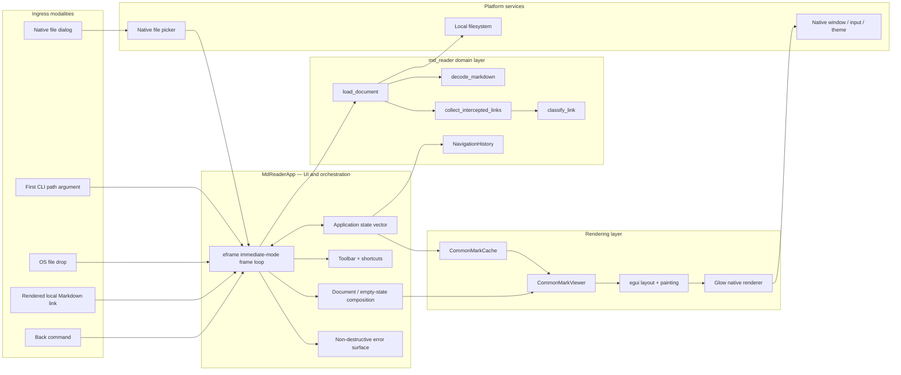

### Architectural layers

| Layer | Responsibility | Principal symbols |
|---|---|---|
| Platform | Windowing, input, native selection, filesystem access | `eframe`, `rfd`, `std::fs` |
| Presentation | Compose toolbar, cards, reader, errors, and empty state | `MdReaderApp`, `show_*`, `paint_liquid_background` |
| Rendering | Parse and paint CommonMark, images, anchors, and link hooks | `CommonMarkViewer`, `CommonMarkCache` |
| Domain | Validate paths, decode bytes, classify destinations, manage history | `LoadedDocument`, `LinkKind`, `NavigationHistory` |
| State transitions | Coordinate successful opens, local traversal, and back operations | `install_document`, `open_explicit`, `follow_local_link`, `go_back` |

### Dependency topology

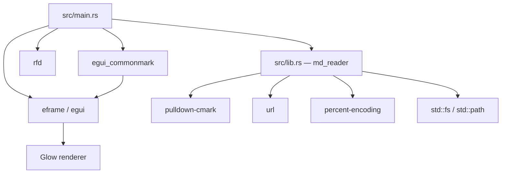

---

## Formal State Model

The live application state is represented by:

```text
MdReaderApp {
    document: Option<LoadedDocument>,
    markdown_cache: CommonMarkCache,
    history: NavigationHistory,
    error_message: Option<String>,
    current_scroll_offset: f32,
    restore_scroll_offset: Option<f32>,
}
```

We define the document representation as:

$$
D = \langle p, m, b, I \rangle
$$

where:

- $p$ is the absolute document path,
- $m$ is the decoded Markdown string,
- $b$ is the directory URI used as the base for relative images,
- $I$ is the sorted, deduplicated set of intercepted link destinations.

A history entry is:

$$
N_i = \langle p_i, y_i \rangle
$$

where $p_i$ is a previously viewed document path and $y_i$ is its last observed vertical scroll offset.

### State transitions

#### Explicit open

An explicit open comes from the CLI, file picker, or drag-and-drop.

$$
\operatorname{OpenExplicit}(p):
\begin{cases}
D' = \operatorname{Load}(p) \\
H' = \varnothing \\
y' = 0 \\
r' = 0 \\
E' = \varnothing
\end{cases}
$$

If loading fails, only the error state changes; the currently displayed document is retained.

#### Local-link traversal

$$
\operatorname{Follow}(p'):
\begin{cases}
D' = \operatorname{Load}(p') \\
H' = H \mathbin{\|} \langle D.p, y \rangle \\
y' = 0 \\
r' = 0 \\
E' = \varnothing
\end{cases}
$$

The history append occurs only after `Load(p')` succeeds.

#### Back-navigation

For the last history entry $\langle p_h, y_h \rangle$:

$$
\operatorname{Back}():
\begin{cases}
D' = \operatorname{Load}(p_h) \\
H' = \operatorname{pop}(H) \\
y' = y_h \\
r' = y_h \\
E' = \varnothing
\end{cases}
$$

The history pop occurs only after the prior document has been reloaded successfully.

### Application state topology

```mermaid
stateDiagram-v2
    [*] --> Empty

    Empty --> Loading: CLI path / Open / Drop
    Loading --> Displaying: load_document = Ok
    Loading --> EmptyWithError: load_document = Err and no document

    EmptyWithError --> Loading: retry open
    EmptyWithError --> EmptyWithError: invalid drop

    Displaying --> LoadingReplacement: explicit open or valid drop
    LoadingReplacement --> Displaying: success; clear history
    LoadingReplacement --> DisplayingWithError: failure; retain document

    Displaying --> LoadingLinked: click local .md link
    LoadingLinked --> Displaying: success; push current path + scroll
    LoadingLinked --> DisplayingWithError: failure; retain document/history

    Displaying --> LoadingBack: Back / Alt+Left
    LoadingBack --> Displaying: success; pop history + restore scroll
    LoadingBack --> DisplayingWithError: failure; retain history

    DisplayingWithError --> LoadingReplacement: explicit retry
    DisplayingWithError --> LoadingLinked: another local link
    DisplayingWithError --> LoadingBack: back retry
    DisplayingWithError --> Displaying: next successful install clears error
```

> The real code stores the error as an overlay field rather than as a mutually exclusive state. The diagram expands that overlay into named states to make the transition semantics visible.

---

## Document Acquisition Pipeline

Loading a document is a staged transformation from a user-selected path to a renderer-ready immutable payload.

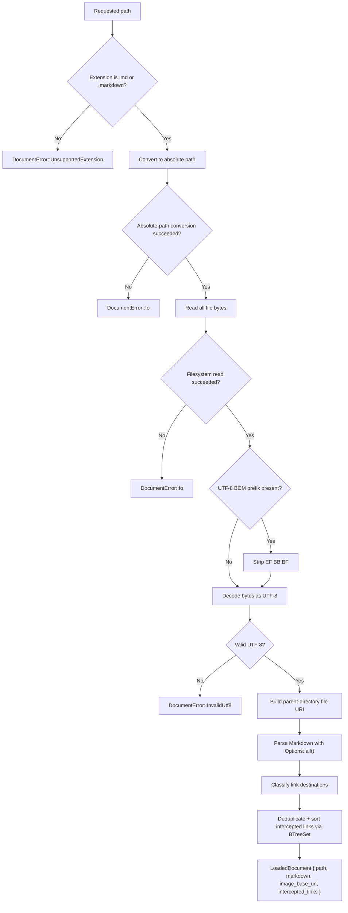

### Acquisition algorithm

```rust
fn conceptual_load(path):
    reject path unless extension is md or markdown
    absolute_path = make_absolute(path)
    bytes = read_entire_file(absolute_path)
    bytes = strip_optional_utf8_bom(bytes)
    markdown = decode_utf8(bytes)
    image_base_uri = parent_directory_as_file_uri(absolute_path)
    intercepted_links = parse_classify_sort_and_deduplicate(markdown)
    return LoadedDocument(...)
```

### Why the base URI matters

A Markdown file commonly references nearby assets:

```markdown

```

MD Reader derives a `file:///.../document-directory/` URI and supplies it as the viewer’s default implicit URI scheme. Relative image references can therefore be resolved against the opened document’s directory rather than the process working directory.

### Decode semantics

| Input | Result |
|---|---|
| Valid UTF-8 | Accepted |
| Valid UTF-8 with `EF BB BF` BOM | BOM removed, then accepted |
| Invalid UTF-8 | Rejected with `InvalidUtf8` |
| UTF-16 / legacy code page | Rejected unless converted to UTF-8 first |

---

## Hyperlink Classification Automaton

MD Reader does not treat every destination equally. It explicitly divides links into four semantic classes:

```rust
pub enum LinkKind {
    Anchor,
    LocalMarkdown(PathBuf),
    External,
    Inactive,
}
```

### Decision graph

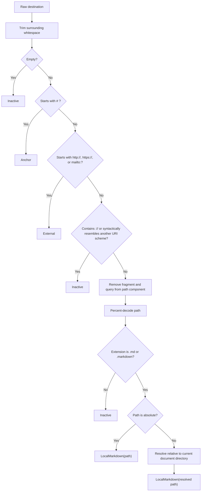

### Classification matrix

| Destination example | Class | Application behavior |
|---|---|---|
| `#overview` | `Anchor` | Viewer-managed heading navigation |
| `https://example.com` | `External` | Not intercepted by the local navigation engine |
| `http://example.com` | `External` | Not intercepted by the local navigation engine |
| `mailto:reader@example.com` | `External` | Not intercepted by the local navigation engine |
| `chapter.md` | `LocalMarkdown` | Resolve relative to current file and open |
| `chapter.markdown` | `LocalMarkdown` | Resolve relative to current file and open |
| `chapter%20one.md#start` | `LocalMarkdown` | Decode path and open `chapter one.md` |
| `/absolute/notes.md` | `LocalMarkdown` where the target platform treats it as absolute | Use the path directly rather than joining it to the current directory |
| `notes.txt` | `Inactive` | Hooked, but no navigation is performed |
| `file:///tmp/notes.md` | `Inactive` | URI-like destination is not followed by local path logic |
| `javascript:alert(1)` | `Inactive` | Explicitly treated as inactive |
| `custom-scheme:payload` | `Inactive` | Unknown URI scheme is inactive |
| empty destination | `Inactive` | No action |

### Interception policy

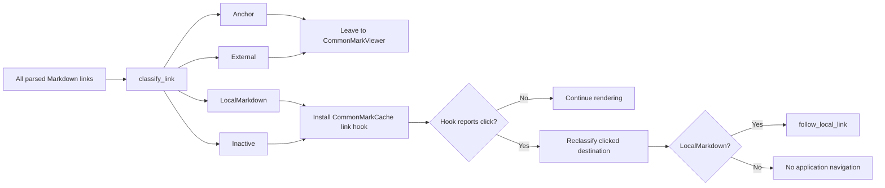

The interception list is built with a `BTreeSet`, which gives the application a deterministic, sorted, duplicate-free destination vector.

---

## Transactional Navigation Protocol

Navigation is intentionally structured so that failed filesystem operations do not corrupt the current reading session.

### Local-link traversal sequence

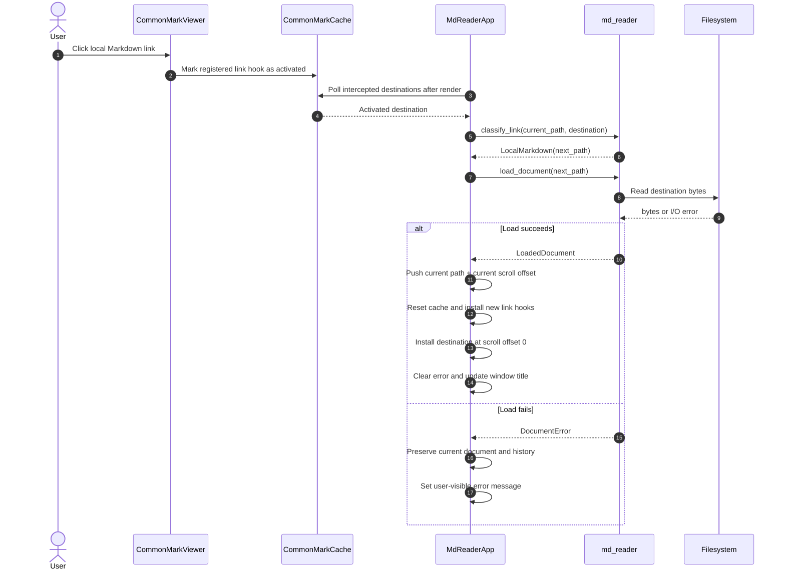

### Back-navigation sequence

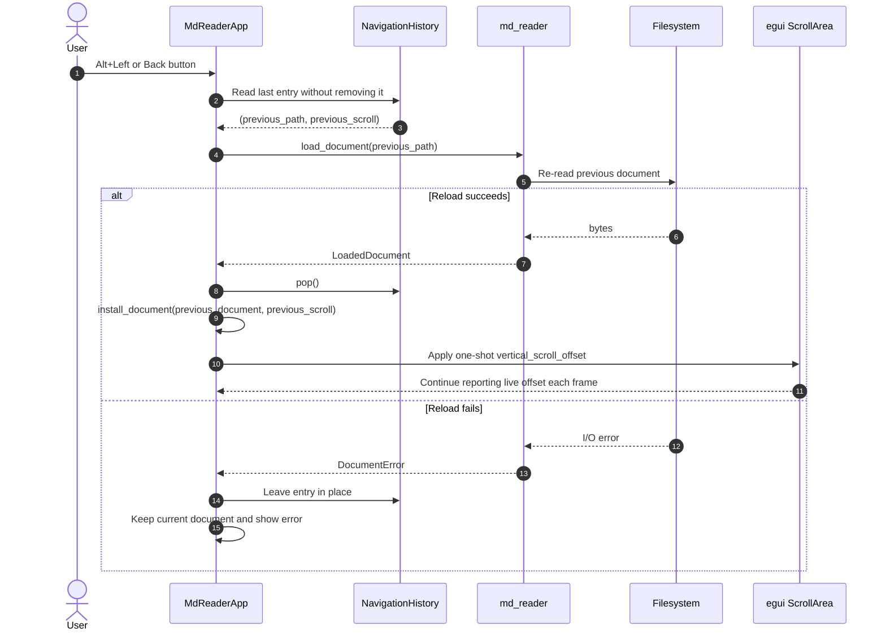

### Navigation graph semantics

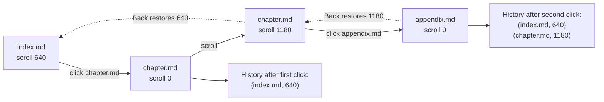

### Session boundary rule

An **explicit open**—CLI, picker, or drop—starts a new navigation session and clears history. A **local-link open** extends the current session and pushes the previous location.

This distinction keeps the Back button semantically aligned with in-document-graph exploration rather than becoming a global recent-files list.

---

## Frame Execution Model

`MdReaderApp` is an immediate-mode UI application. Every frame reevaluates input, composes the interface, renders the document, and then commits requested actions.

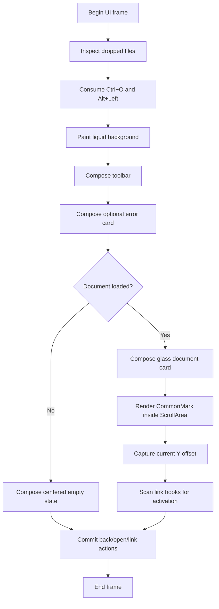

### Why actions are committed after composition

The frame first collects intent into local flags such as `toolbar_open`, `toolbar_back`, `empty_open`, and `clicked_link`. It then performs file dialogs and navigation after the UI composition block. This keeps mutation points concentrated and avoids changing the active document in the middle of its own rendering pass.

### Input convergence

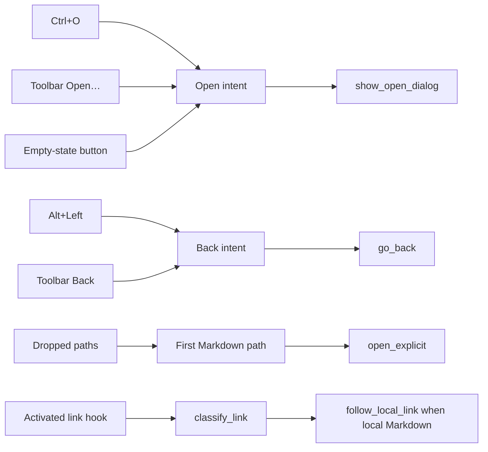

---

## Visual System

The application uses `ThemePreference::System` and then customizes both light and dark `egui` style trees.

### UI composition graph

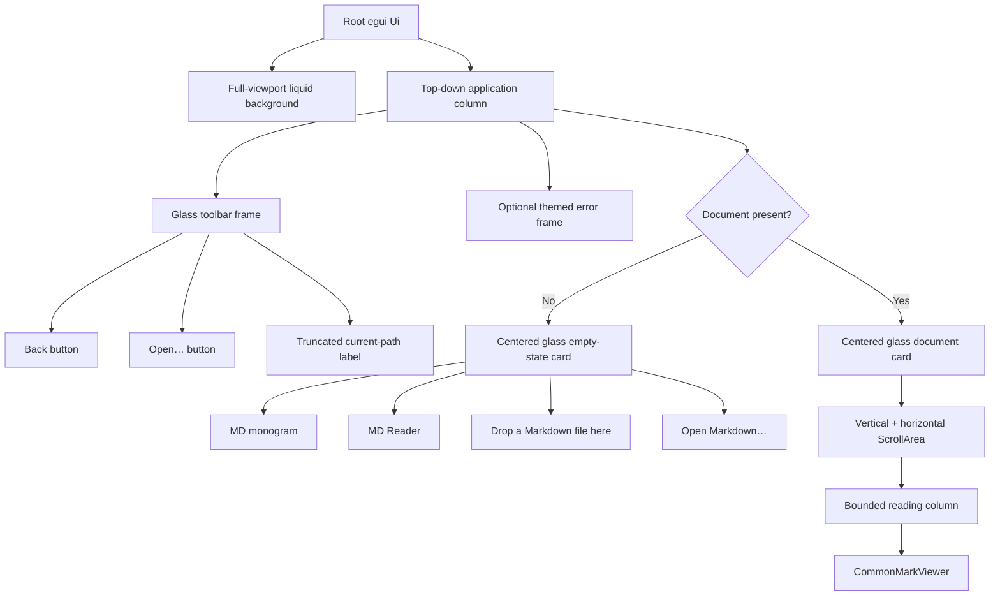

### Window geometry

| Parameter | Value | Purpose |
|---|---:|---|
| Default window size | `960 × 720` | Comfortable initial reading surface |
| Minimum window size | `480 × 320` | Prevent unusably small layout |
| Maximum reading width | `980 px` | Bound text measure on large windows |
| Maximum document-card width | `1080 px` | Preserve visual hierarchy and margins |
| Empty-state target width | `440 px` | Compact centered call-to-action |
| Empty-state target height | `208 px` | Stable visual footprint |

### Typography

| Text style | Size | Family |
|---|---:|---|
| Body | `16 px` | Proportional |
| Monospace | `14 px` | Monospace |
| Button | `14 px` | Proportional |

### Theme adaptation

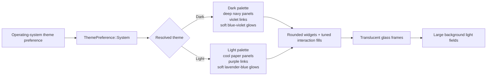

### Liquid-background model

The background is not a texture or shader. It is a deliberately lightweight composition:

1. Fill the available viewport with the theme’s base color.
2. Paint one large translucent violet circle near the upper-left region.
3. Paint one larger translucent blue circle near the lower-right region.
4. Place semi-opaque rounded content frames above the fields.

This produces a glass-like visual system without introducing a custom GPU pipeline.

### Responsive document layout

The document card width is derived from available width and clamped to a maximum. The reader content receives its own bound, while horizontal scrolling remains enabled for wide code blocks or content that cannot wrap safely.

Rendered images are assigned a maximum width derived from the current reading width, preventing ordinary images from expanding beyond the reading column.

---

## Core Data Model

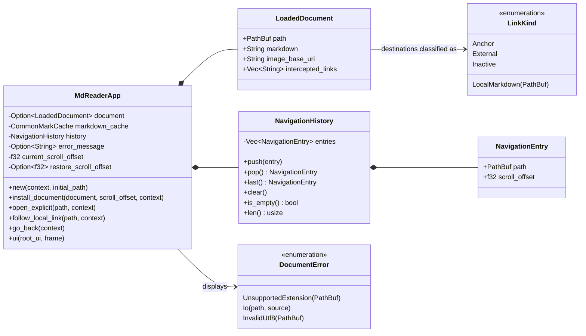

### Type responsibilities

| Type | Responsibility |
|---|---|
| `LoadedDocument` | Fully prepared, renderer-facing document payload |
| `DocumentError` | Human-readable load failure taxonomy |
| `LinkKind` | Closed classification of link behavior |
| `NavigationEntry` | Path plus preserved vertical coordinate |
| `NavigationHistory` | Encapsulated LIFO stack operations |
| `MdReaderApp` | Stateful UI orchestration and transition logic |

### Cache lifecycle

Every successful document installation replaces the previous `CommonMarkCache` with a fresh default cache, then registers hooks for that document’s intercepted destinations.

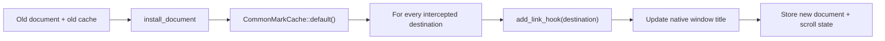

This avoids carrying document-specific render and interaction state into a newly opened file.

---

## Correctness Invariants

The implementation contains several useful invariants that are easy to miss when looking only at the interface.

### Invariant 1 — Failed local traversal is non-destructive

`follow_local_link` attempts `load_document(path)` before it pushes the current document into history or replaces the active document.

Therefore:

$$
\operatorname{Load}(p') = \operatorname{Err} \Rightarrow D' = D \land H' = H
$$

Only the error message changes.

### Invariant 2 — Failed back-navigation does not consume history

`go_back` clones the final history entry, attempts to reload it, and calls `pop()` only after a successful load.

Therefore:

$$
\operatorname{Reload}(H_{last}.p) = \operatorname{Err} \Rightarrow H' = H
$$

The user can fix the filesystem problem and retry the same Back operation.

### Invariant 3 — Explicit opens define a new session

On successful explicit open, `history.clear()` executes before the loaded document is installed. Back-navigation cannot cross the explicit-open boundary.

### Invariant 4 — Scroll restoration is one-shot

The restored scroll value is stored in `restore_scroll_offset`. During document rendering, `.take()` consumes it and configures the `ScrollArea` once. Subsequent frames use the live scroll state rather than repeatedly forcing the old coordinate.

### Invariant 5 — Link hooks are document-coherent

A fresh cache is constructed whenever a document is installed, and hooks are installed only from that new document’s intercepted link vector.

### Invariant 6 — The window title tracks the active document

A successful install sets the title to:

```text
MD Reader - <document file name>
```

If the file name is not valid Unicode, the code falls back to a lossy path representation.

### Invariant proof graph

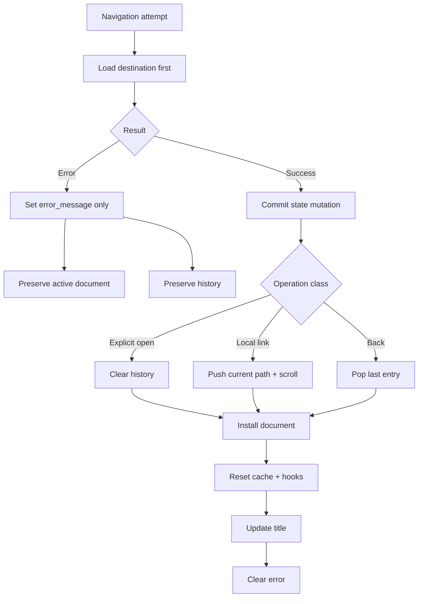

---

## Complexity and Performance Envelope

No runtime benchmark suite is defined in the current source tree, so this section reports structural and asymptotic properties rather than fictional performance numbers.

Let:

- $B$ = document size in bytes,
- $L$ = number of Markdown link events,
- $I$ = number of intercepted unique destinations,
- $H$ = navigation-history depth.

### Load complexity

A document load performs a full file read, UTF-8 decode, Markdown event pass, classification of link destinations, and insertion of intercepted destinations into a `BTreeSet`.

$$
T_{load}(B, L) = O(B) + O(L \log I)
$$

Since $I \leq L$:

$$
T_{load}(B, L) \subseteq O(B + L\log L)
$$

Memory is approximately:

$$
M_{document} = O(B + I)
$$

excluding renderer-internal caches and decoded image resources.

### Operation matrix

| Operation | Approximate complexity | Notes |
|---|---:|---|
| Extension validation | `O(1)` relative to document size | Examines the path extension |
| File read | `O(B)` | Reads the complete file into memory |
| BOM removal | `O(1)` prefix check | Subsequent clone/decode remains linear |
| UTF-8 decode | `O(B)` | Produces owned `String` |
| Markdown event scan | `O(B)` | Parser traverses the source |
| Intercepted-link insertion | `O(log I)` each | `BTreeSet` |
| History push | Amortized `O(1)` | Backed by `Vec` |
| History pop | `O(1)` | Removes last entry |
| History peek | `O(1)` | Reads last entry |
| Activated-hook discovery | `O(I)` worst case per rendered frame | Linear `.find()` over intercepted destinations |
| Back document restoration | `O(B + L log L)` | Re-reads and reparses the previous file |

### Pipeline cost topology

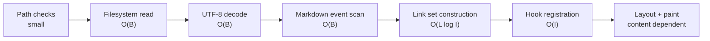

### Practical interpretation

For ordinary notes and README-sized documents, the architecture favors simplicity and correctness over streaming complexity:

- the entire source file is held in memory,
- the complete Markdown source is parsed when loaded,
- previous files are re-read on Back rather than retained as full document snapshots,
- history stores only paths and scroll offsets,
- no explicit worker threads or asynchronous loading pipeline appear in the source.

### Candidate optimization frontier

For very large document graphs, future optimization could focus on:

1. Replacing the per-frame linear hook scan with an event queue or directly returned activated destination.
2. Caching recently loaded `LoadedDocument` values while validating filesystem freshness.
3. Adding incremental or background parsing for very large files.
4. Bounding history depth or using a configurable cache policy.

These are prospective improvements, not current features.

---

## Source Topology

The current two-file Rust implementation contains **818 lines**, including tests and whitespace.

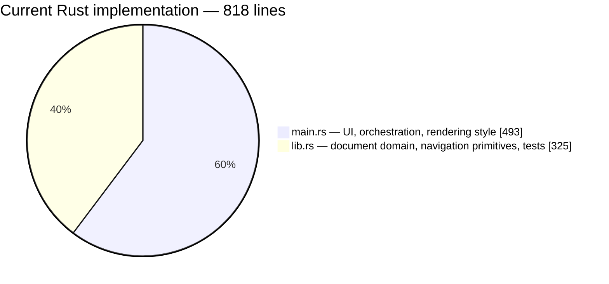

### Responsibility distribution

| File | Lines in current snapshot | Primary responsibility |
|---|---:|---|
| [`src/main.rs`](src/main.rs) | 493 | Native app lifecycle, UI, rendering composition, input, visual styling |
| [`src/lib.rs`](src/lib.rs) | 325 | Document loading, UTF-8 handling, URI derivation, link classification, history, tests |
| **Total** | **818** | Complete current implementation snapshot |

### Expected repository layout

```text
.
├── Cargo.toml
├── README.md
├── fixtures/
│   └── markdown-showcase.md     # referenced by an integration-style unit test
└── src/
    ├── lib.rs                   # document and navigation domain
    └── main.rs                  # native application and visual layer
```

> Dependency versions and feature flags are defined by the repository’s `Cargo.toml`. The test in `lib.rs` expects `fixtures/markdown-showcase.md` to exist and contain the showcase heading and a `next.md#start` link.

---

## Verification Matrix

Eight unit tests are defined in `lib.rs`.

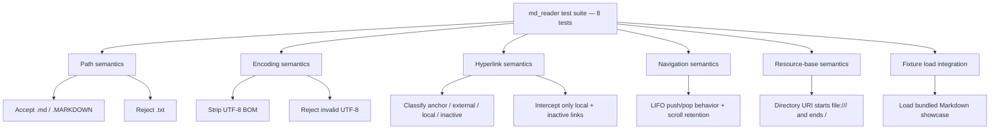

The graph contains more leaf assertions than test functions because several tests validate multiple related conditions.

### Test-by-test evidence table

| Test | What it protects |
|---|---|
| `accepts_supported_extensions_case_insensitively` | `.md` / `.markdown` extension policy and case-insensitivity |
| `decodes_utf8_and_strips_a_bom` | UTF-8 BOM normalization |
| `rejects_invalid_utf8` | Explicit failure on invalid encoding |
| `classifies_supported_links` | Anchor, web, email, percent-decoded local Markdown, inactive text file, inactive script scheme |
| `intercepts_local_and_unsupported_links_only` | Hook policy for local and inactive destinations |
| `navigation_history_is_last_in_first_out` | Stack order and scroll-offset persistence |
| `directory_uri_ends_with_a_separator` | File URI shape required for relative resource resolution |
| `loads_the_bundled_markdown_fixture` | End-to-end fixture acquisition and intercepted-link extraction |

### Reproducibility protocol

From the repository root:

```bash
cargo fmt --check
cargo clippy --all-targets --all-features -- -D warnings
cargo test
cargo run -- fixtures/markdown-showcase.md
```

A complete verification run requires the project’s `Cargo.toml`, resolvable dependencies, and the referenced fixture. The badge above intentionally says “8 defined” rather than claiming a particular CI result.

### Testing frontier

The defined tests concentrate on the domain layer. High-value additions would include:

- failed-load state preservation,
- explicit-open history clearing,
- successful back-navigation scroll restoration,
- cross-platform relative path cases,
- query/fragment combinations,
- drag-and-drop selection when multiple paths are present,
- UI-level shortcut and button behavior,
- visual regression snapshots for light and dark modes.

---

## Installation

### Requirements

- A stable Rust toolchain with Cargo.
- Native build prerequisites required by the configured `eframe`, `rfd`, and renderer features for your target operating system.
- A graphics environment supported by the project’s `eframe::Renderer::Glow` configuration.

### Clone and build

```bash
git clone <repository-url>
cd <repository-directory>
cargo build --release
```

The release binary will be placed under `target/release/`. Its exact filename follows the package/binary name declared in `Cargo.toml`.

### Run in development

```bash
cargo run
```

This starts the app with no document loaded and presents the empty state.

### Run with an initial document

```bash
cargo run -- path/to/document.md
```

Only the first non-program command-line argument is used as the initial path.

### Windows release behavior

The crate uses:

```rust
#![cfg_attr(not(debug_assertions), windows_subsystem = "windows")]
```

On Windows, non-debug builds use the GUI subsystem and do not open an additional console window.

---

## Usage

### Open a file

There are three explicit ingress paths:

1. Pass a Markdown path as the first command-line argument.
2. Click **Open…** or **Open Markdown…** and choose a file in the native dialog.
3. Drag one or more files onto the window; the first dropped path recognized as Markdown is opened.

### Navigate a local document graph

Given:

```text
docs/
├── index.md
├── concepts.md
├── appendix.markdown
└── images/
    └── system.png
```

`index.md` can contain:

```markdown
# Index

[Concepts](concepts.md)
[Appendix](appendix.markdown)


```

Clicking `Concepts` opens `concepts.md`. The current `index.md` path and scroll position are pushed onto history. Clicking **Back** or pressing `Alt+Left` reloads `index.md` and restores the captured vertical offset.

### Keyboard and pointer controls

| Action | Control |
|---|---|
| Open Markdown | `Ctrl+O` |
| Go back | `Alt+Left` |
| Open file dialog | Toolbar **Open…** button |
| Go back | Toolbar **< Back** button |
| Open from empty state | **Open Markdown…** button |
| Open by drag-and-drop | Drop a `.md` or `.markdown` file on the window |
| Scroll | Mouse wheel, touchpad, or platform scroll input |
| Horizontal overflow | Horizontal scrolling is enabled in the document area |
| Follow heading anchor | Click an intra-document `#heading` link |
| Follow local Markdown link | Click a relative or absolute `.md` / `.markdown` destination |

### Window title behavior

With `notes.md` open, the native title becomes:

```text
MD Reader - notes.md
```

### Empty state

With no active document, the app shows a centered glass card containing:

- an `MD` monogram,
- the application name,
- a drop-file prompt,
- an open-file button.

### Error behavior during use

An invalid open displays a themed error card. If a valid document was already open, it remains visible beneath the error surface.

---

## Supported Document Semantics

### File acceptance

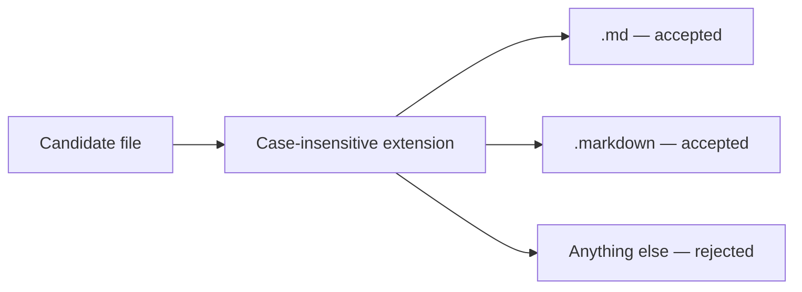

| Property | Behavior |
|---|---|
| `.md` | Accepted |
| `.markdown` | Accepted |
| Upper/mixed-case extension | Accepted |
| No extension | Rejected |
| Other extension | Rejected |
| Empty file | Valid UTF-8 and therefore loadable |
| Invalid UTF-8 | Rejected |
| UTF-8 BOM | Removed |

### Markdown parsing

The domain layer parses link events with:

```rust
Parser::new_ext(markdown, Options::all())
```

The visual layer renders through `CommonMarkViewer` and enables heading scrolling.

### Images

- Relative image references use the opened document’s directory URI as their base.
- Maximum image width follows the current reading width.
- Image behavior beyond these explicit settings is delegated to `egui_commonmark` and its configured loaders/features.

### Local links with fragments and queries

For classification and filesystem resolution, the path component is separated from query/fragment suffixes and percent-decoded. For example:

```text
chapter%20one.md#start
```

resolves to a filesystem path ending in:

```text
chapter one.md
```

The current implementation opens the linked document at scroll offset `0`; it does not explicitly transfer a cross-document fragment such as `#start` into a post-load heading jump.

### Relative path semantics

Relative Markdown links are joined to the parent directory of the current document. The resulting path is not explicitly canonicalized or restricted to a project root.

---

## Error Model

```rust
pub enum DocumentError {
    UnsupportedExtension(PathBuf),
    Io {
        path: PathBuf,
        source: std::io::Error,
    },
    InvalidUtf8(PathBuf),
}
```

### Failure taxonomy

```mermaid
flowchart TD
    REQUEST["Open request"] --> EXT{"Supported extension?"}
    EXT -- No --> UNSUPPORTED["UnsupportedExtension<br/>‘… is not a .md or .markdown file.’"]
    EXT -- Yes --> ABSREAD{"Absolute-path conversion and read succeed?"}
    ABSREAD -- No --> IO["Io<br/>‘Could not open …: source’"]
    ABSREAD -- Yes --> UTF8{"Valid UTF-8 after optional BOM?"}
    UTF8 -- No --> INVALID["InvalidUtf8<br/>‘… is not valid UTF-8 Markdown.’"]
    UTF8 -- Yes --> SUCCESS["LoadedDocument"]
```

### User-facing messages

| Error | Message shape |
|---|---|
| Unsupported extension | `<path> is not a .md or .markdown file.` |
| I/O failure | `Could not open <path>: <system error>` |
| Invalid UTF-8 | `<path> is not valid UTF-8 Markdown.` |
| Dropped files contain no Markdown | `Drop a .md or .markdown file to open it.` |

### Error lifecycle

- An error remains stored until a later successful document installation replaces it with `None`.
- The source contains no dedicated dismiss button.
- A failed open does not automatically clear the current document.
- A failed Back does not remove the history entry that failed to reload.

---

## Security and Trust Boundaries

MD Reader is a local document viewer, not a filesystem sandbox.

### Implemented defensive behavior

- Only `.md` and `.markdown` paths are followed by the application’s local navigation engine.
- Empty destinations are inactive.
- Unknown URI schemes are inactive.
- URI-like destinations containing `://` are inactive unless they are recognized HTTP(S) links before that check.
- `javascript:`-style destinations are classified as inactive; this behavior is covered by a unit test.
- Invalid UTF-8 input is rejected rather than decoded ambiguously.
- Failed navigation leaves the current document and history state intact.

### Trust-boundary graph

```mermaid
flowchart LR
    USER["User-selected local document"] --> FS["Filesystem boundary"]
    FS --> BYTES["Untrusted bytes"]
    BYTES --> UTF8["Strict UTF-8 decoder"]
    UTF8 --> MARKDOWN["Markdown parser / renderer"]

    MARKDOWN --> LINK["Link destinations"]
    LINK --> CLASSIFIER["Application classifier"]
    CLASSIFIER --> LOCAL["Local .md path"]
    CLASSIFIER --> EXTERNAL["HTTP(S) / mailto"]
    CLASSIFIER --> INACTIVE["Other schemes / unsupported paths"]

    LOCAL --> FS
    EXTERNAL --> RENDERER_POLICY["Renderer / platform default behavior"]
    INACTIVE --> STOP["No app navigation"]
```

### Important non-guarantees

- Relative links may contain `..` and can resolve outside the current document directory.
- Explicit opens accept absolute filesystem paths. Absolute destinations inside Markdown links are platform-sensitive because URI-scheme detection occurs before `PathBuf::is_absolute`.
- Paths are made absolute but are not explicitly canonicalized in the shown code.
- On Windows, a literal drive-letter link such as `C:\docs\notes.md` can resemble a URI scheme (`C:`) to the current classifier and therefore be treated as inactive; opening the same path through the CLI, picker, or drag-and-drop does not use that link classifier.
- There is no configured “workspace root” or containment policy.
- The application re-reads prior files during Back; filesystem contents may have changed since the first view.
- This README does not claim HTML sanitization, remote-image isolation, or network blocking because those behaviors depend on renderer and dependency configuration beyond the two Rust source files documented here.

For untrusted document collections, consider adding an optional root-directory policy, canonicalization checks, and explicit renderer resource rules.

---

## Known Limitations

The current implementation is intentionally focused. The following behaviors are not present in the documented source:

1. **No forward stack.** Back-navigation is LIFO, but there is no corresponding Forward operation.
2. **No persistent session.** Open document, history, theme-resolved state, and scroll offsets are not saved across launches.
3. **No live reload.** Changes on disk are not watched while a file remains open.
4. **No editor.** The application is a reader, not a Markdown authoring environment.
5. **No search or outline panel.** There is no full-text search, heading tree, or table-of-contents sidebar.
6. **No cross-document anchor restoration.** `chapter.md#section` opens the file, but the app does not explicitly scroll the newly loaded document to `#section`.
7. **No multi-tab model.** Exactly one document is active.
8. **No history cap.** The path-and-scroll stack can grow for the lifetime of the process.
9. **No document cache.** Back-navigation re-reads and reparses the target file.
10. **No root sandbox.** Explicit opens and eligible local Markdown links can access paths beyond the current directory.
11. **Platform-sensitive drive-letter links.** A literal Windows link such as `C:\docs\notes.md` can be classified as an inactive URI-like destination because of the drive-letter colon.
12. **No explicit error dismissal.** Successful loading clears the error.
13. **First-argument-only CLI.** Additional command-line paths are ignored by the shown startup logic.
14. **First-valid-drop behavior.** When multiple files are dropped, the first Markdown path is selected.
15. **UTF-8 only.** Other encodings must be converted before opening.
16. **Domain-heavy test coverage.** UI interactions and rendering appearance are not covered by the defined unit tests.

---

## Roadmap

A plausible evolution path, ordered from small ergonomic gains to full knowledge-graph overengineering:

```mermaid
flowchart LR
    V1["Current core<br/>open + render + local back"] --> V11["Forward history"]
    V11 --> V12["Cross-document anchors"]
    V12 --> V13["Reload + file watching"]
    V13 --> V14["Recent files + session persistence"]
    V14 --> V2["Outline + search"]
    V2 --> V21["Tabs / split view"]
    V21 --> V22["Document graph visualization"]
    V22 --> V23["Workspace-root policy"]
    V23 --> V3["Cached graph-scale knowledge browser"]
```

### Near-term

- Add Forward navigation with a second stack.
- Preserve and apply cross-document anchor fragments.
- Add Reload and optional file watching.
- Add a dismiss control for errors.
- Add recent-document history.
- Persist the last window geometry and active document.

### Reader ergonomics

- Heading outline / table of contents.
- Full-text search with match navigation.
- Zoom and font-size controls.
- Copy-link and reveal-in-file-manager actions.
- Optional line-numbered code blocks.
- Print or export-to-PDF workflow.

### Graphmaxxing tier

- Parse local Markdown links into a workspace knowledge graph.
- Visualize backlinks and orphan documents.
- Compute strongly connected components in the note graph.
- Rank documents by local PageRank, because opening notes was clearly not enough.
- Prefetch adjacent documents into an LRU cache.
- Add a graph minimap whose complexity exceeds that of the reader itself.

---

## Contributing

Contributions should preserve the project’s strongest existing property: small, legible control flow with explicit state transitions.

### Suggested workflow

```bash
git checkout -b feature/descriptive-name
cargo fmt
cargo clippy --all-targets --all-features -- -D warnings
cargo test
cargo run -- fixtures/markdown-showcase.md
```

### Contribution principles

- Keep filesystem and link semantics in the domain layer where they can be tested without a window.
- Keep visual composition and platform interaction in the application layer.
- Load before mutating navigation state.
- Add tests for every new path or link classification rule.
- Avoid silently broadening the set of followed URI schemes.
- Document platform-specific behavior.
- Prefer a clear state invariant over a clever shortcut.

### High-value starter issues

- Add cross-document heading targets.
- Add a forward stack with transactional behavior symmetric to Back.
- Test failed local-link and failed-back state preservation.
- Add canonicalized workspace-root enforcement as an opt-in mode.
- Add a file-change indicator.
- Add a heading outline generated from the same Markdown parse.

---

## Dependency Roles

Exact versions and feature flags belong in `Cargo.toml`; the source imports reveal the following conceptual dependency set.

| Crate / module | Role |
|---|---|
| [`eframe`](https://crates.io/crates/eframe) | Native app lifecycle, viewport configuration, Glow renderer |
| [`egui`](https://crates.io/crates/egui) | Immediate-mode layout, input, painting, widgets, themes |
| [`egui_commonmark`](https://crates.io/crates/egui_commonmark) | Markdown rendering, cache, image sizing, heading scrolling, link hooks |
| [`rfd`](https://crates.io/crates/rfd) | Native Markdown file picker |
| [`pulldown-cmark`](https://crates.io/crates/pulldown-cmark) | Markdown event parsing for link discovery |
| [`percent-encoding`](https://crates.io/crates/percent-encoding) | Percent-decoding local link paths |
| [`url`](https://crates.io/crates/url) | Conversion of document directories into `file:///` base URIs |
| Rust standard library | Paths, files, errors, collections, environment arguments |

---

## Algorithm Reference

### Algorithm A — Explicit open

```text
INPUT: requested path p
1. Attempt load_document(p).
2. On error:
   a. Set error_message.
   b. Preserve current document and history.
3. On success:
   a. Clear history.
   b. Reset the Markdown cache.
   c. Register destination hooks.
   d. Update the window title.
   e. Install the document at scroll offset 0.
   f. Clear the error.
```

### Algorithm B — Local-link open

```text
INPUT: activated destination d, current document D, scroll y
1. Classify d relative to D.path.
2. Continue only if class = LocalMarkdown(p).
3. Attempt load_document(p).
4. On error:
   a. Set error_message.
   b. Preserve D and history H.
5. On success:
   a. Push (D.path, y) onto H.
   b. Reset cache and register hooks.
   c. Install destination at scroll offset 0.
```

### Algorithm C — Back

```text
INPUT: history H
1. If H is empty, return.
2. Clone the last entry e without removing it.
3. Attempt load_document(e.path).
4. On error:
   a. Set error_message.
   b. Leave H unchanged.
5. On success:
   a. Pop H.
   b. Install the loaded document.
   c. Set current and restore scroll offsets to e.scroll_offset.
```

### Algorithm D — Dropped-file selection

```text
INPUT: list of dropped paths P
1. If P is empty, return.
2. Find the first path whose extension is md or markdown.
3. If found, perform explicit open.
4. Otherwise, show the Markdown-only drop error.
```

---

## Design Rationale

### Why store paths instead of full documents in history?

The history entry is only `(PathBuf, f32)`. This keeps history lightweight and ensures Back reflects the file’s current on-disk contents. The tradeoff is that a deleted, moved, or newly invalid file cannot be restored until the filesystem issue is resolved.

### Why use a fresh render cache for every document?

Render caches and link hooks are document-specific. Reinitializing the cache makes the installation boundary explicit and prevents old destination hooks from leaking into a new document.

### Why intercept inactive links?

The link collector registers both local Markdown and inactive destinations. This allows the application to take control of links it does not want the default renderer to treat as ordinary external navigation. When activated, only a reclassified `LocalMarkdown` destination is followed.

### Why use a `BTreeSet` for intercepted destinations?

It simultaneously deduplicates repeated destinations and yields deterministic sorted output. This is especially useful for reproducible tests and predictable cache-hook registration.

### Why reclassify after a hook fires?

The document stores destination strings rather than precomputed `LinkKind` values. Reclassification at activation produces the resolved local path relative to the current document and ensures the final action still passes through the same centralized policy.

### Why preserve both `current_scroll_offset` and `restore_scroll_offset`?

They serve different temporal roles:

- `current_scroll_offset` is the continuously observed live position used when pushing history.
- `restore_scroll_offset` is a one-frame command used to initialize a newly installed previous document.

---

## Operational Examples

### Open a README from the repository root

```bash
cargo run -- README.md
```

### Open a path containing spaces

```bash
cargo run -- "notes/research program.md"
```

### Build once, then open documents directly

```bash
cargo build --release
./target/release/<binary-name> "docs/index.md"
```

### Construct a local document graph

`index.md`:

```markdown
# Research Index

- [System Model](system-model.md)
- [Evaluation](evaluation.markdown)
- [Appendix](appendix.md)
```

`system-model.md`:

```markdown
# System Model

[Back to index](index.md)

See [Evaluation](evaluation.markdown).
```

The files form a directed graph:

```mermaid
flowchart LR
    INDEX["index.md"] --> SYSTEM["system-model.md"]
    INDEX --> EVAL["evaluation.markdown"]
    INDEX --> APPENDIX["appendix.md"]
    SYSTEM --> INDEX
    SYSTEM --> EVAL
```

MD Reader traverses this graph one document at a time while maintaining a session-local return stack.

---

## FAQ

### Is this an editor?

No. It is a read-only Markdown viewer.

### Does it require a local web server?

The application code reads Markdown from local filesystem paths and renders it in a native `eframe` window. No local HTTP server is implemented in the documented source.

### Does it support both light and dark mode?

Yes. It follows the system preference and applies dedicated palettes to each resolved theme.

### Can it open links to other Markdown files?

Yes. Relative destinations ending in `.md` or `.markdown` are resolved against the current document and opened by the application. Absolute link syntax is platform-sensitive, and URI-like destinations are intentionally inactive.

### Does Back restore my position?

Yes. The current vertical scroll offset is stored with the previous path and reapplied when Back successfully reloads that document.

### Does it support Forward?

Not currently.

### Can it open non-UTF-8 Markdown?

No. It accepts UTF-8, including files with an optional UTF-8 BOM.

### What happens when a linked file is missing?

The current document remains active, history is not mutated, and a user-visible I/O error appears.

### Does it sandbox local links to the current folder?

No. Relative links can traverse directories, and explicit opens can target arbitrary absolute paths. Eligible local-link path syntax is also not constrained to a workspace root.

### Why is this README so large?

Because the application is small enough that the documentation budget could safely absorb the entire surplus complexity of the project.

---

## Citation

For papers, benchmarks, grant proposals, architecture reviews, or unusually serious personal note systems:

```bibtex
@software{md_reader,
  title  = {MD Reader: A Local-First Native Markdown Projection Engine},
  author = {MD Reader Contributors},
  note   = {Rust desktop application for state-preserving local Markdown traversal}
}
```

---

## License

Link the repository’s chosen license here—for example, `[MIT](LICENSE)` or `[Apache-2.0](LICENSE)`—after confirming the actual `LICENSE` file. The Rust source alone does not establish a license.

---

## Acknowledgements

MD Reader is built on the Rust desktop and Markdown ecosystem, particularly `eframe`, `egui`, `egui_commonmark`, `pulldown-cmark`, `rfd`, `url`, and `percent-encoding`.

---

## Conclusion

MD Reader intentionally solves a narrow problem with a compact architecture:

```mermaid
flowchart LR
    FILE["Markdown file"] --> VALIDATE["Validate + decode"]
    VALIDATE --> RENDER["Render beautifully"]
    RENDER --> TRAVERSE["Follow local document links"]
    TRAVERSE --> RESTORE["Return to the exact prior scroll context"]
```

Its implementation separates visual orchestration from document semantics, treats navigation as a transactional state change, preserves user context through scroll-aware history, and keeps failure behavior understandable. It is simple enough to audit, useful enough to run every day, and now documented as though it were the reference implementation for planetary-scale Markdown inference.

<div align="center">

**MD Reader — because opening a text file deserves an architecture diagram.**

</div>
